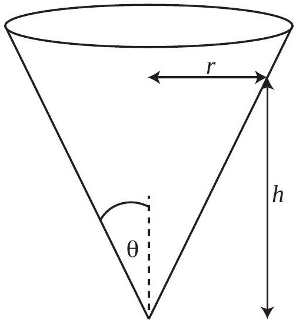

Question 11
Suggested Time: 20 min
Consider a hollow, frictionless inverted cone within which an object of mass $m$ is free to slide. The cone has an angle of $\theta$ between its central axis and sloped side, and a radius $r$ at height $h$.

a) The object of mass $m$ is released from rest at height $h$ to slide inside the cone.
    (i) What will be its speed when it reaches the bottom?
    (ii) What assumption(s) did you make in the previous part?

b) The object of mass $m$ is collected and released again, but in the horizontal direction this time, with speed $v$. It slides in a circular path around the inside of the cone. Hence, its acceleration is $a=v^{2} / r$ towards the central axis of the cone.
    (i) Draw a diagram showing the forces acting on the mass.
    (ii) Find the magnitude of the normal force on the mass.
    (iii) Find an expression for the height of the mass.
c) The object of mass $m$ continues along its circular path until it is bumped slightly so that its speed is unchanged, but it is now directed slightly down the cone (but still mostly around the cone). Describe and explain the motion of the mass.
