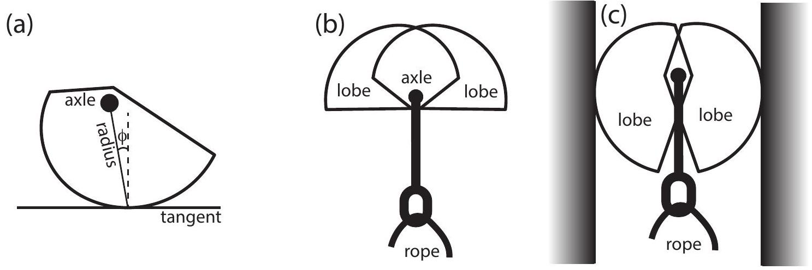
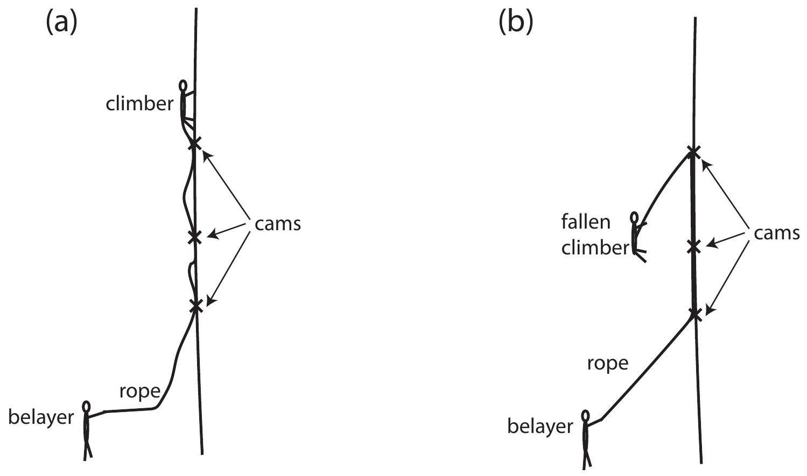

## Question 12

Suggested Time: 25 min
The logarithmic spiral is a curve that is seen often in nature, for example in sea shells and sunflowers. It is also known as a constant angle spiral, because it has the property that at each point on the curve, the angle between the radius (the line to the centre of the spiral) and the tangent is constant; this angle is $90^{\circ}-\phi$ as shown in Fig 1(a).

Figure 1: (a) A logarithmic spiral with angle $\phi$, radius and tangent marked. (b) A spring-loaded camming device (cam) with lobes extended. (c) The same cam with lobes retracted and placed in a parallel sided crack.

The spring-loaded camming device (cam for short) is a piece of rock climbing equipment based on the logarithmic spiral and its properties. A cam's purpose is to protect the climber by limiting the distance he or she can fall.

Figure 2: (a) A climber using cams for protection. (b) A climber after a fall.

A cam is comprised of two lobes, each the shape of a section of a logarithmic spiral whose centres are on a common axle; this axle is attached to the rope and hence the climber. The springs in the device restore the cam to the shape shown in Figure 1(b). The lobes can be retracted (releasing the springs) allowing the cam to be placed in a crack in the rock as shown in Figure 1(c). If the climber falls, the downward force from the fall is converted by the cam to an outward force on the rock. Friction keeps the cam in place in the crack. The frictional force has a maximum value $F_{\mathrm{fr}}=\mu N$ where $N$ is the normal force.

a) Suppose a climber places a cam in a parallel-sided crack. Draw all the forces on the cam in a labelled free body diagram on p. 4 of the Answer Booklet, when
    (i) the climber is above the cam
    (ii) the climber has fallen and is hanging from the cam
b) Cams rely on friction to work; it is dangerous to use them on smooth rock. What is the minimum coefficient of friction $\mu$ that the rock should have, in terms of the camming angle $\phi$ ?
Note that the force exerted by the axle on each lobe must be along the line joining the axle with the point of contact of that lobe with the rock, or the lobe will rotate. You may assume the force due to the spring on each lobe is negligible, and the cam lobes do not deform the rock.
c) What does the logarithmic spiral shape of the cam lobes mean for the cam's functionality at different amounts of retraction?
d) As a climber climbs above a cam they may inadvertently pull the cam from side to side. Consider the springs' forces on the lobes of a cam placed in a crack and pulled from side to side.
    (i) Describe the effect that this will have on the cam. Explain your reasoning with the help of diagrams.
    (ii) Circle the diagram showing the safer crack for a climber to use on p. 5 of the Answer Booklet. Give reasons for your answer.
