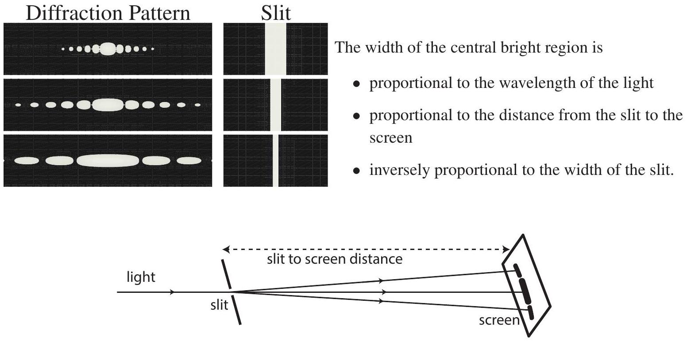

Question 14
Suggested Time: 20 min
When light passes through a very narrow slit it diffracts. This means that the light spreads out and forms a pattern with bright and dark spots on a distant screen. Some examples of these patterns are shown below, with magnified images of the slits that generated them to the right. The wavelength of the light and the distance from the slit to the screen were kept constant in these images.

Figure 4: Light diffracting through a narrow slit.

a) Red light of wavelength 650 nm is shone though a slit of width $3.0 \times 10^{-4} \mathrm{~m}$ onto a screen 1.20 m from the slit and produces the pattern labelled "(a)" below. Exactly one of the slit width, wavelength or distance to screen was changed to produce the pattern labelled "(b)" below. For each possible parameter below find its required value to make pattern "(b)":
    (i) slit width, (a)
    (ii) wavelength, (iii) distance from the slit to the screen. (b)
Give your answers in the spaces on p. 8 of the Answer Booklet.
b) A diffraction pattern from a different single slit is shown on p. 8 of the Answer Booklet. Draw a possible single slit which could have produced this pattern in the box to the right of the pattern.
c) When a narrow slit is replaced by a small rectangular aperture (hole) the light spreads out in all directions and forms a pattern such as the one labelled Example on p. 8 of the Answer Booklet. Draw diagrams to fill in the blanks of diffraction patterns or aperture shapes in the table on pp. 8-9 of the Answer Booklet.
d) Explain why the width of the central bright region is proportional to the distance from the slit to the screen.

## Integrity of Competition

If there is evidence of collusion or other academic dishonesty, students will be disqualified. Markers' decisions are final.
