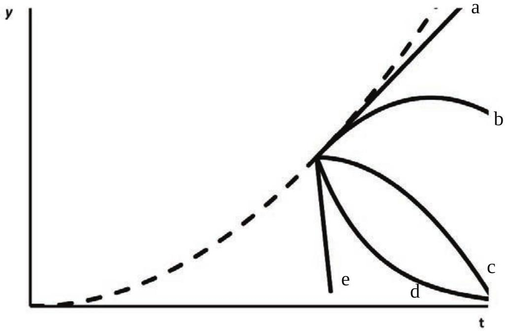

## Question 8

An elevator in a four storey building is moving upward with constant acceleration. The dashed curve shows the position $y$ of the ceiling of the elevator as a function of the time $t$. At the instant indicated by the set of branching (solid) curves, a bolt breaks loose and drops from the ceiling. In the absence of air resistance, which curve best represents the position of the bolt as a function of time as seen by an observer who is not in the lift?

