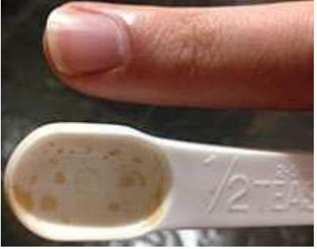

## Question 9

Matt is going to make a cake for Alix's birthday. The recipe says to use half a teaspoon of cinnamon, but he can't find a clean teaspoon. Instead he decides to weigh an appropriate amount on his kitchen scales. To the nearest order of magnitude, what is the mass of half a teaspoon of cinnamon?

a. 0.01g
b. 0.1g
c. 1g
d. 10g
e. 100 g
