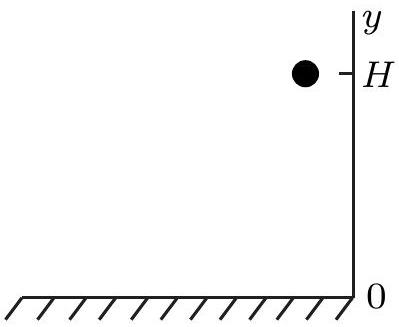
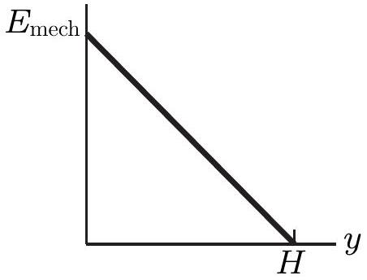
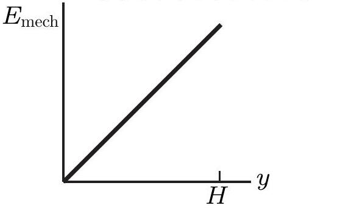
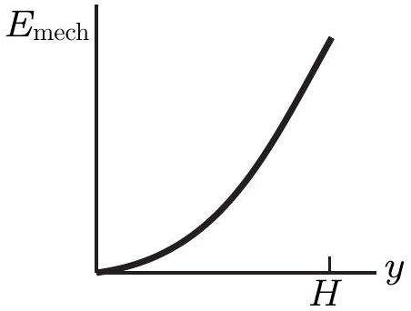
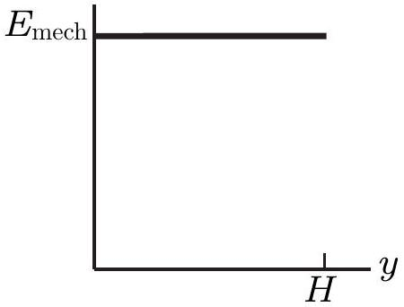

## Question 7

A ball is held at a height $H$ above a floor, as sketched in the diagram on the right. It is then released and falls to the floor. If air resistance can be ignored, which of the five graphs below (labelled a. to e. beneath each graph) correctly gives the mechanical energy $E_{\text {mech }}$ of the Earth-ball system as a function of the altitude $y$ of the ball?

$E_{\text {mech }}$

a.

d.

e.
