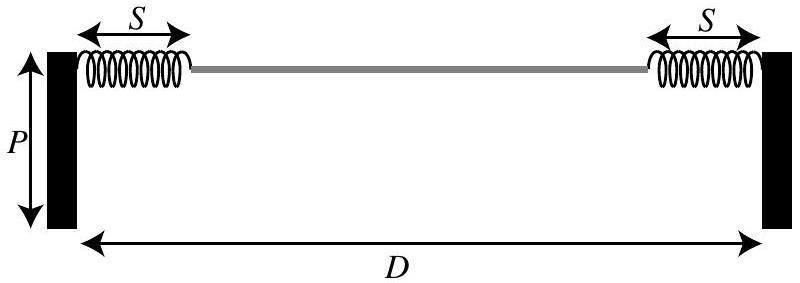
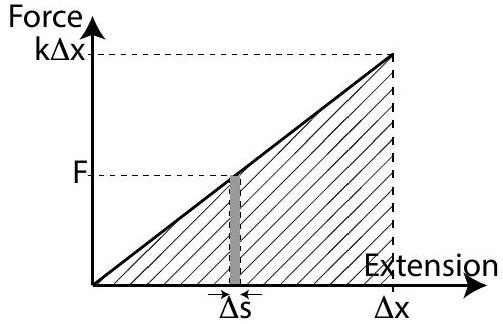
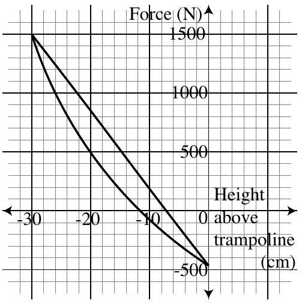

Question 13
Suggested Time: 25 min
A simple, ideal, 2-dimensional model of a trampoline is shown below. Two poles of height $P$ are fixed in the ground a distance $D$ apart. A spring of length $S$ is joined to each of the poles and the other ends of the springs are joined to a length of unstretchable material which is just long enough to fit between the springs. The springs and the material are assumed to have no mass.

When a spring is stretched it will exert a restoring force. This force is proportional to the extension $\Delta x$ of the spring, which is the extra length of the stretched spring, so $F_{\text {spring }}=-k \Delta x$.
The work done by a constant force $F$ which moves an object a distance $\Delta s$ is $W=F \Delta s$. As shown in the diagram to the right, the work done to stretch a spring by a short distance $\Delta s$ is the area of the grey rectangle. Hence, the work done to stretch a spring to an extension of $\Delta x$ is the area of the triangle filled with diagonal lines, $W_{\text {spring }}=\frac{1}{2} k(\Delta x)^{2}$.

a) On p. 6 of the Answer Booklet, sketch the shape of the springs and material, and the forces acting on the combined person and material system, if a person sits still on the centre of the trampoline.

The person begins jumping on the trampoline and then reaches a state where the ideal trampoline is bouncing them up into the air to a height $H$ every bounce.

b) On p. 6 of the Answer Booklet, sketch the shape of the springs and material, and the forces acting on the combined person and material system, when the person is at the lowest point of the bounce on the trampoline. Justify the differences and similarities between sketches for parts (a) and (b).
c) On the axes on p. 7 of the Answer Booklet, sketch the magnitude of each force as a function of height above the surface of the unstretched trampoline for one bounce up and down. Clearly label each curve, including the direction of motion.

A real trampoline is 3-dimensional and its springs and material are not ideal. The graph to the right shows the net force upwards on a person versus height for the part of one bounce where the person is touching the trampoline.

d) (i) Find the mass of the person on the trampoline.
    (ii) On the graph on p. 7 of the Answer Booklet, label the two curves "moving down" and "moving up". Justify your answer.
    (iii) Estimate the area between the two curves.

(iv) Explain the physical meaning of this area.
