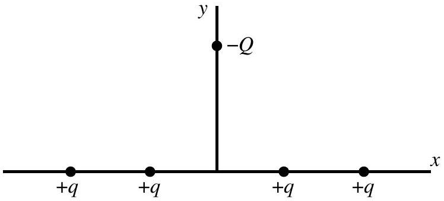

Question 7
Four particles, each of charge $+q$, are arranged symmetrically on the $x$-axis about the origin as shown. A fifth particle of charge $-Q$ is placed on the positive $y$-axis as shown. What is the direction of the net electrostatic force on the fifth particle?

a. ↑
b. →
c. ↓
d. ←
e. The net electrostatic force on the particle of charge $-Q$ is zero.

