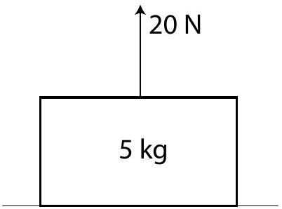

Question 8
A block of mass 5 kg lies at rest on a horizontal surface. An upwards force of 20 N is applied to the block, as shown. Assuming $g=10 \mathrm{~m} \mathrm{~s}^{-2}$, what is the weight of the block?

a. 3 kg
b. 5 kg
c. 30 N
d. 50 N
e. $5 \mathrm{~kg}-20 \mathrm{~N}$
