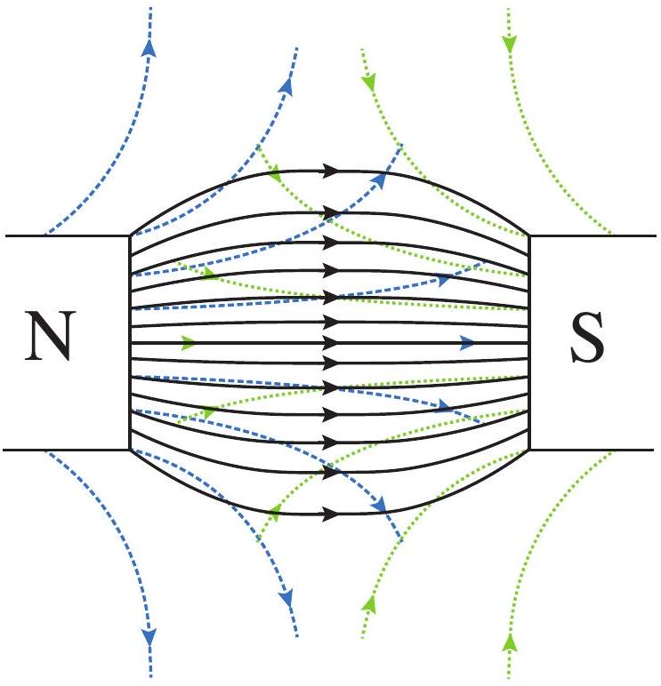
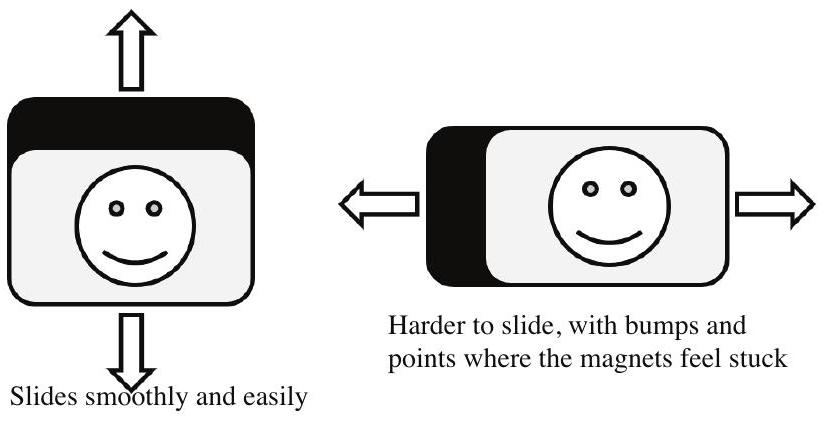

Question 13
Maggie has two identical fridge magnets. The magnetism of the fridge magnets can be thought of as due to many tiny bar magnets. A bar magnet has a north pole and a south pole, and magnetic field surrounding it as shown to the right. Field lines closer together indicate a stronger magnetic field, while the arrows indicate the direction of the magnetic field. Like poles repel, and opposite poles attract.
The magnetic field of two magnets is the superposition of the individual magnets, becoming stronger where the two contributions are in the same direction and weaker where they are in opposite directions.

a) Apply the principle of superposition to sketch magnetic field line diagrams for the two arrangements of bar magnets shown on p. 6 of the Answer Booklet.

Maggie's fridge magnets will only stick to the fridge on one side - the black side - and the two fridge magnets stick to each other most strongly when the black sides are touching. They won't stick to each other at all if the two picture sides are touching. This leads Maggie to believe that on the black side of a fridge magnet the magnetic field is very strong, and on the other side it is very weak.

b) Show how bar magnets could be arranged to make a very strong field on one side, and a weak field on the other. You do not need to include a full magnetic field line diagram with your arrangement, but you should indicate where superposition of the fields results in a stronger or weaker field, and the approximate direction of the field.

When Maggie's two fridge magnets are stuck together with their black sides touching, they are more easily slid apart vertically compared to horizontally. Maggie also notices that sliding apart in the horizontal direction feels bumpy, with the magnets alternating between slightly attracting and repelling each other.

c) On the diagram on p. 7 of the Answer Booklet, draw how small bar magnets might be arranged, either as a grid, rows or columns, in one of Maggie's fridge magnets. You may use as many, or as few, of the diagrams as you need to describe the arrangement. You may draw the bar magnets as arrows to simplify your diagrams.
