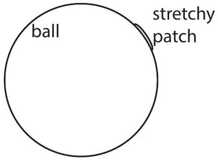
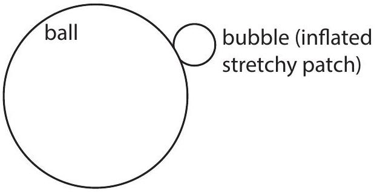

Question 14
Air applies a force due to its pressure uniformly across any surface it contacts. A stretching wall requires a certain amount of force to expand, and applies a force on the air inside, increasing the inside pressure needed to keep the air contained. This is why a balloon stretches and if you untie it, the air is pushed out. A large firm ball is full of air. The ball has a small bubble made of a stretching wall attached to it that starts out empty.

Someone squeezes the ball such that they apply a steadily increasing additional pressure to the ball and hence the air inside it. After a short time the bubble begins to inflate. Once it starts inflating, it rapidly increases in size. The firm ball's size hardly changes throughout.

a) (i) Sketch the pressure inside the ball versus time since the squeezing began.
    (ii) Sketch, roughly, the volume of the bubble versus time since the squeezing began.
    (iii) Sketch, roughly, the force applied per area of the small bubble versus its volume.
    (iv) Sketch, roughly, the force applied per area of the small bubble versus the amount of gas in the small bubble.
b) If instead of squeezing the ball, it is heated at a constant rate, explain whether or not you would expect your sketches to change. You might find the following relationship between temperature $T$, pressure $p$ and volume $V$ for an ideal gas to be useful: $p V=A T$ where $A$ is a constant depending only on the amount of gas. $A$ is directly proportional to the amount of gas.

A group of students are given the challenge of designing an experiment to measure the change in the force per area applied by the stretchy wall as a function of its size. They have at their disposal a range of common objects, including heaters, scales, air pumps, and basic measuring tools, but do not have a large budget or any purpose-built lab spaces.

c) Design an experiment to perform that the students could use. Include what you would need to measure and how.
d) For your design, where do you think the most likely sources of uncertainty in your results will come from? Remember to think about all parts of the experiment, not just the resolution of your instruments.

## Integrity of Competition

If there is evidence of collusion or other academic dishonesty, students will be disqualified. Markers' decisions are final.
