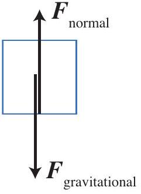
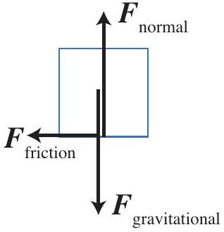
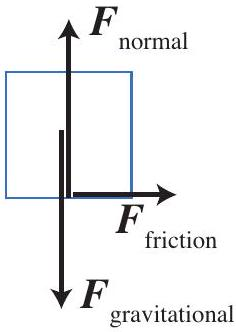
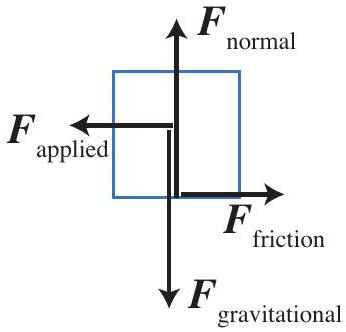
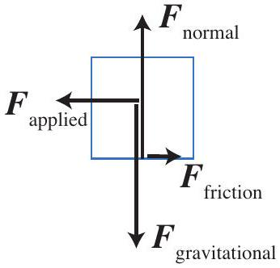

## Question 5

Once the trolley is at the desired speed, Trish keeps it at that constant speed. Which of the following diagrams correctly shows the forces acting on the box as it moves at constant speed to the left? The length of the force arrows is proportional to the size of the force. Ignore air resistance.

a.

b.

c.

d.

e.
