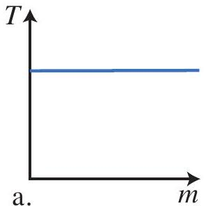
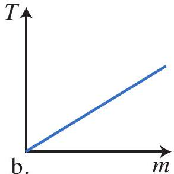
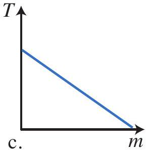

Question 8
Beatrice has decided to use a dynamic method to find $k$ for her spring. She measures the period, $T$, of oscillation for a mass, $m$, on a spring for a series of different masses. The equation that relates period to mass is: $T=2 \pi \sqrt{\frac{m}{k}}$. If Beatrice plots a graph of $T$ vs $m$, which of the following graphs will her plot look like?

e.
