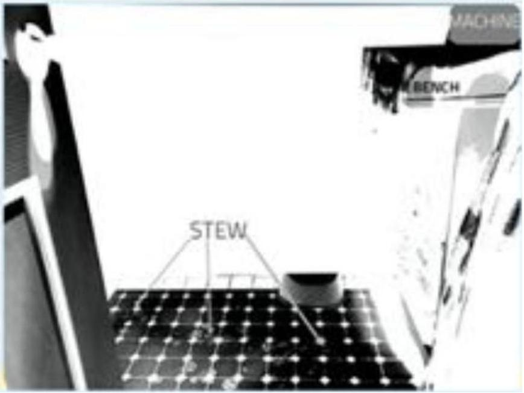

10. A car is travelling at 120 km/h, when the driver sees a herd of cows on the road ahead and slams on the brakes. The performance of the car's brakes is such that the car comes to a stop in a distance $D$ metres. Assuming that the acceleration of the car under braking is independent of the car's speed, what distance would the car require to come to a stop if it were travelling at 40 km/h instead?
    A. D/9 metres
    B. $D / 6$ metres
    C. D/4 metres
    D. $D / 3$ metres
    E. $D$ meters

## Section B: How fast can you shoot that stew?

Bobbie has built a machine which sits on a kitchen bench to automatically serve food on to plates. It shoots food out sideways onto the plates. Unfortunately it was filled with some stew which was too liquid and has shot the stew onto the floor, making a big mess. This is shown in the photo below:

The following equations apply to motion under constant acceleration:

$$
\begin{aligned}
& V=u+a t \\
& s=u t+\frac{1}{2} a t^{2} \\
& V^{2}=u^{2}+2 a s
\end{aligned}
$$

The variables in the above equations are:
$t$ the time from some initial time
$v$ the speed of the object at time $t$
$u$ the initial speed of the object
$s$ the displacement from the initial position of the object
$a$ the acceleration of the object

The acceleration due to gravity is $g=9.80 m s^{-2}$.
