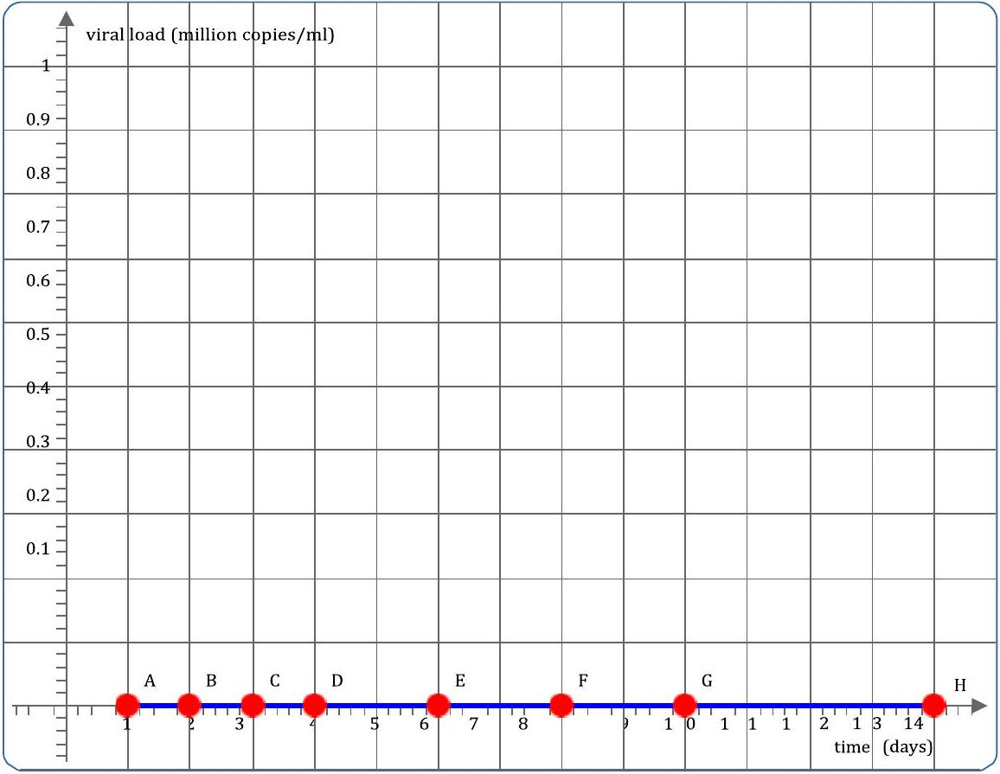

18. The level of viral infection in a particular bodily fluid is called the viral load and measured in copies of the virus per millilitre. In respiratory viruses it is common to measure the viral load in the fluid at the back of the nose. In a typical viral infection of a person who has no immunity to a virus, the viral load initially increases until the immune system responds strongly, then peaks and decreases at a rate proportional to the number of copies of the virus remaining, as the body rids itself of the infection. The rates of increase and decrease, and the time for the immune system to respond depend on the type of virus.
In a particular virus it is found that the virus copied in the fluid at the back of the nose initially replicates, so each copy becomes two copies, every 6 hours. This replication continues for two days after infection without any slowing due to the immune response. On day 3 , the viral load peaks at 1 million copies/ml as the immune system starts to respond to the virus. On day 4, the viral load has reduced slightly to 900,000 copies/ml and then continues to decrease at a rate proportional to the viral load, reaching 300,000 copies/ml on day 7.
Sketch the viral load over time between 1 and 14 days after infection for this particular virus.

## Section E: Waves on a string

In this question you will consider how to investigate the speed of wave pulses on a string with a fixed end.

Some definitions of words which may help you answer this question about waves are:

- Amplitude: The maximum height of a wave or pulse.
- Frequency: The number of peaks which pass a point per second. Measured in $\mathrm{Hz}=\mathrm{s}^{-1}$.
- Wavelength: The distance between two peaks of a wave.

For a particular string with a fixed end there are four variable to consider:

- The amplitude, which represents the maximum height of the pulse.
- The pulse width, which represents the length of time between the start and end of the pulse.
- Damping, which represents how much energy is lost as the pulse propagates, which decreases its amplitude overtime.
- Tension, which measures how tightly the string is pulled.
