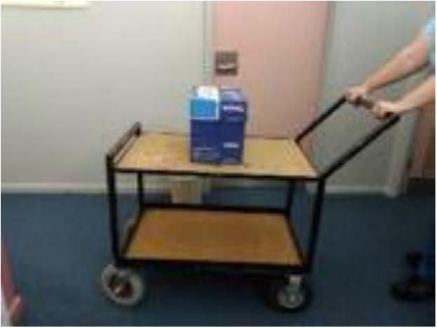

7. Trish is moving boxes of photocopy paper on a trolley. The top of the trolley is flat, and a box sits on it as shown. Trish pushes the trolley, accelerating it to the left, as shown. Which force, if any, is causing the box to accelerate? Ignore air resistance.

    A. Applied force
    B. Friction force
    C. Gravitational force
    D. Normal force
    E. None - no force is required
