10. A kookaburra observes the collision, and laughs so hard it falls off the branch it is perched on, at an initial height $H$. Ignoring air resistance, which graph below correctly shows the mechanical energy of the kookaburra - Earth system as a function of the kookaburra's height above ground, $y$ ? Assume that the kookaburra is laughing so hard that it neglects to fly.

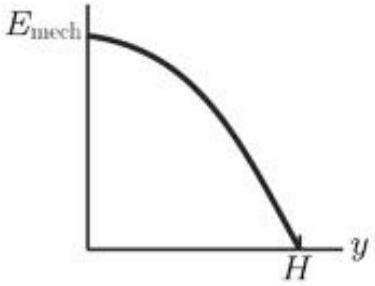
a.

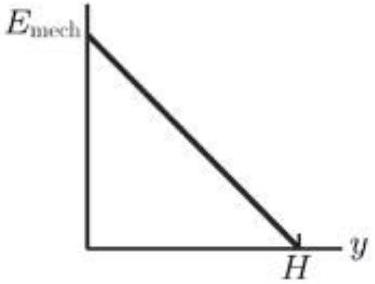
b.

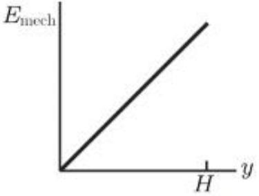
c.

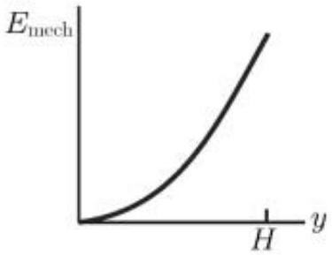
d.

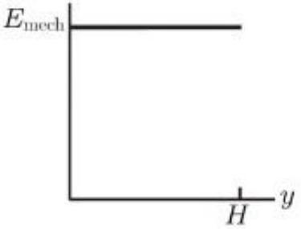
e.

    A. a
    B. b
    C. c
    D. d
    E. e

## Section B: Runners

## Suggested time: 16 minutes

Kara runs with her friend Anna around a track of length $\mathrm{L}=2 \mathrm{~km}$. Anna complete two laps of the track in $t_{1}=25$ minutes. Kara completes two laps of the track in $t_{2}=20$ minutes.

a) Write an expression for Anna's speed $v_{1}$, and also find the numerical value of this speed.
b) In certain time $t$ Kara gets to be one full lap ahead of Anna.
    i) Write a sentence in words to describe the relationship between this time and other known variables.
    ii) Write an equation representing the same relationship.
    iii) Hence or otherwise find the time it takes for Kara to get one full lap ahead of Anna.
c) How fast would Kara need to run to get one full lap ahead of Anna when Anna has run 2.7 laps?

## Section C: Sugar gliders

## Suggested time: 16 minutes

A typical sugar glider has a mass of $m_{1}=100 \mathrm{~g}$ and head to body length of $l_{1}=18 \mathrm{~cm}$. It glides by extending its arms and legs to tighten flaps of skin called the patagium which act as glider wings. A typical glide is at a speed of around $v_{1}=7.0 \mathrm{~m} / \mathrm{s}$ at an angle of around $a_{1}=30^{\circ}$ down from the horizontal.
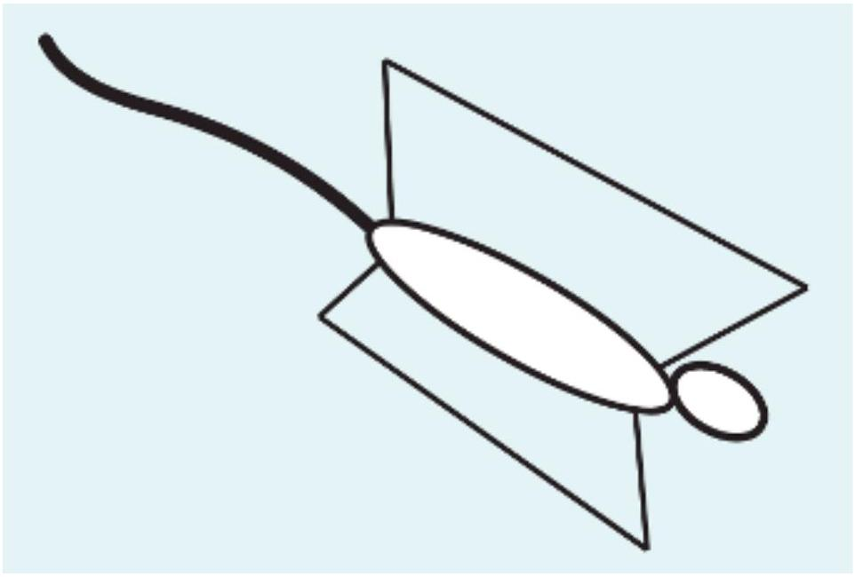
The gliding occurs because there is a lift force on the wings which must be $L=W \cos a$ to maintain a constant gliding angle $a$. Here $W$ is the weight of the sugar glider. The lift force is a proportional to the area of the wings and also proportional to the square of the speed of the glider.

Some landowners in outback Australia claim to have found a fossil of a giant sugar glider with a head to body length of around $l_{2}=80 \mathrm{~cm}$.

Throughout this question you may use the following variables:
$m_{1}$ the mass of a typical sugar glider
$m_{2}$ the mass of the fossil animal when it was alive
$l_{1}$ the head to body length of a typical sugar glider
$l$ the head to body length of the fossil animal
$v_{1}$ the typical gliding speed of a typical sugar glider
$v_{2}$ the typical gliding speed of the fossil animal
$a_{1}$ the typical gliding angle of a typical sugar glider
$a_{2}$ the typical gliding angle of the fossil animal
$A_{1}$ the area of the patagium (glider wings) of a typical sugar glider
$A_{2}$ the area of the patagium (glider wings) of the fossil animal

a)
    i) Write an expression relating $m_{2}$, the mass of the fossil animal when it was alive, to the mass of a typical sugar glider.
    ii) Use your expression to estimate the mass of the fossil animal when alive.
b) Write an expression for the area of the patagium of the fossil glider $A_{2}$ compared to the area of the patagium of the typical sugar glider $A_{1}$. You may include any other variables used in this question.

Animals are considered to fly if they can move their wings to generate thrust. They are considered to glide if they can travel though air at a constant angle which is less that $45^{\circ}$ to the horizontal. They are considered to parachute if they can slow their fall but it is always at an angle of more than 45° to the horizontal.

c) Assuming that the typical gliding speed of the fossil animal $v_{2} \approx v_{1}$, could the fossil animal glide, fly or parachute? To support your conclusion, include in your answer an equation relating the angle $a_{2}$ to other variables.
d) What is the minimum speed at which the fossilized glider would need to launch to be able to glide?

Suggested time: 26 minutes

a) Once in the blood many drugs are metabolised by the liver to form substances which are easier for the body to excrete. The rate at which the liver metabolises the drug is proportional to the concentration of the drug in the blood.

One such drug is used to treat a common respiratory illness in children. When the initial blood concentration is $20 \mu \mathrm{~g} / \mathrm{L}$ and after four hours the blood concentration is $10 \mu \mathrm{~g} / \mathrm{L}$.

i) Plot points to represent the information above the axes below.
ii) Sketch a prediction for concentration in the blood over 24 hours on the same axes.

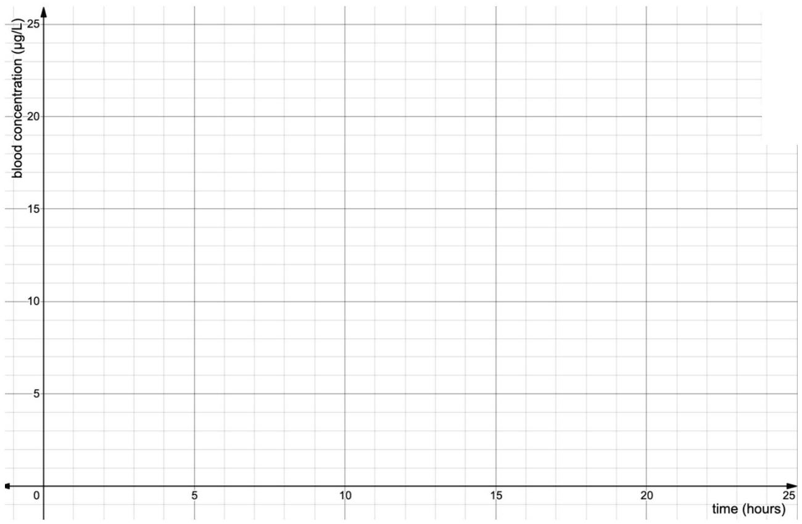

Some medicines have more complex metabolic pathways, undergoing a range of chemical reactions in the body at different rates, to produce a range of substances called metabolites. Some of these substances may contribute to the action of the medicine, these are called active metabolites. Others are waste products which do not contribute to the action of the medicine and are called inactive metabolites.

Some medicines are called pro-drugs because they are not active but they produce active metabolites which are drugs. One example of a common pro-drug is used for pain relief in adults.

The diagram below shows the main metabolic pathways for this pro-drug, including the three main active metabolites. The values on the arrows show the probability of one molecule of the first substance reacting to form the second substance each hour. The total rates for each reaction are proportional to the amount of the starting substance in each case.
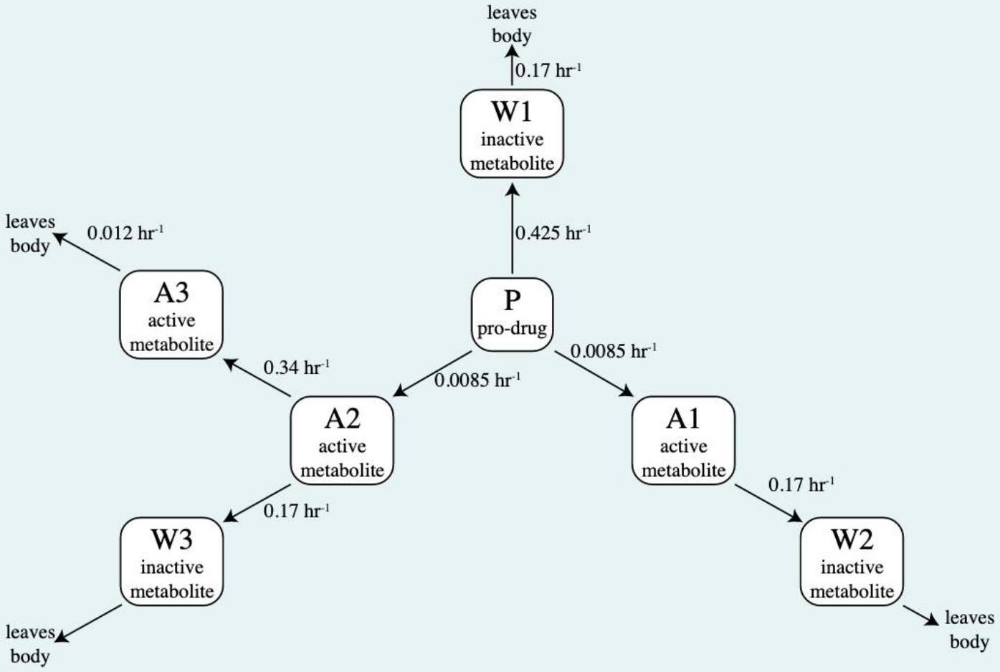

b) The graph below shows the concentration of the pro-drug, P (solid black line), and its metabolite W1 (dashed black line) versus time after an intravenous (directly into the blood) does of P.
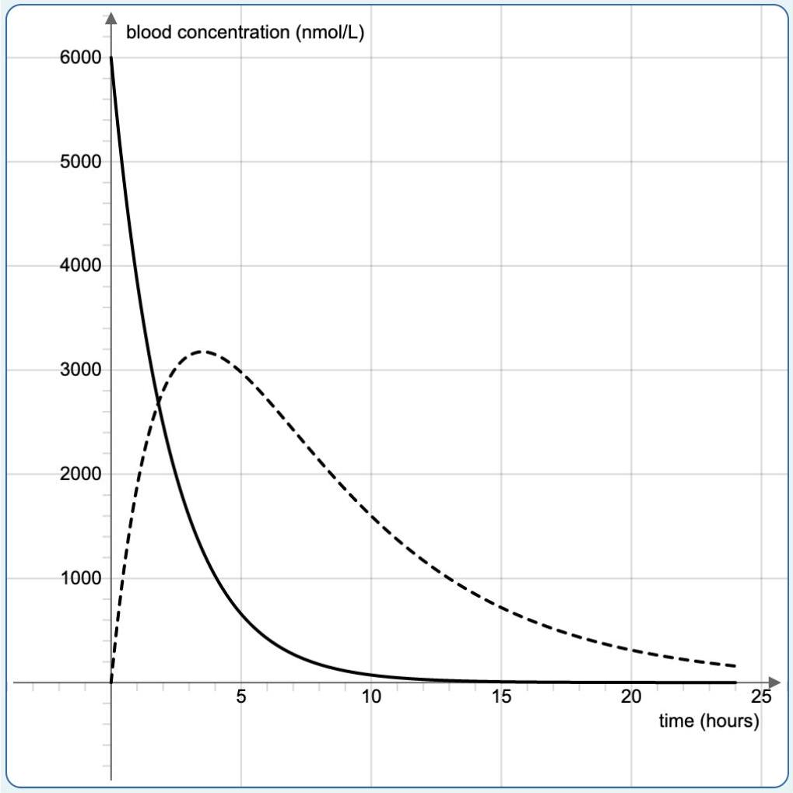
    i) Describe how the concentration of W1 would change if the rate of the reaction converting P to W1 were increased and the rate of W1 leaving the body remained the same.
    ii) Describe how the concentration of W1 would change if the rate of the reaction converting P to W1 remained around the same and the rate of W1 leaving the body were increased.
    iii) Describe how the shape of the curve for W1 at times long after the maximum would change if the rate of the reaction converting P to W1 were increased and the rate of W1 leaving the body remained the same.
    iv) Describe how the shape of the curve for W1 at times long after the maximum would change if the rate of the reaction converting P to W1 remained around the same and the rate of W1 leaving the body were increased.

c) Sketch the concentration of active metabolite A1 versus time on the axes below. Your sketch does not need to be exact, but should have approximately correct scale in both concentration and time. You need to add appropriate scales for both axes.
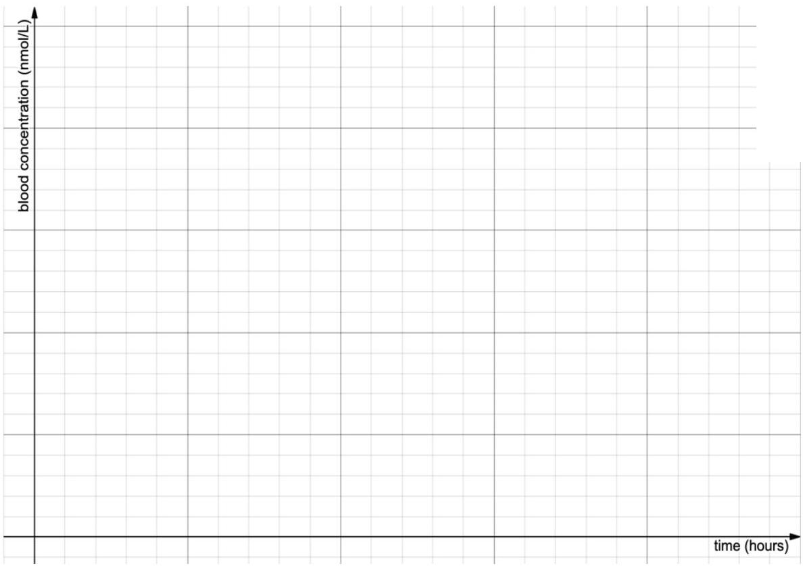
d) Give reasons for each of your answers in this part.
    i) Shortly after the dose of pro-drug P was given will A2 or A3 have a higher concentration?
    ii) A long time after the dose of pro-drug P was given will A2 or A3 have a higher concentration?
    iii) When A2 is at its maximum concentration, how large will the ratio of concentration of A2 to concentration of P be?
    iv) When A3 is at its maximum concentration, how large will the ratio of concentration of A3 to concentration of A2 be?
e)
    i) Sketch the concentration of active metabolite A2 versus time on the axes above. Clearly mark which curve corresponds to A2.
    ii) Also sketch the concentration of active metabolite A3 versus time on the same axes. Clearly mark which curve corresponds to A3. Your sketches do not need to be exact, but should have approximately correct scale in both concentration and time.

f) A measurement of the ratio of the blood concentration of A2 to the blood concentration of P can be used to estimate the time since a dose of P in cases where this is unknown.
    i) Explain why it is necessary to measure the ratio of the blood concentrations rather than use a single concentration.
    ii) Describe how this ratio changes with time, and identify the times at which it will help make a reasonable estimate.

## Section E: Surprising shadows

## Suggested time: 24 minutes

During the night, someone enters a room containing a sink to wash their hands, and turns on the single light bulb in the room. Their immediate view is this image:

As the person stretches their arms, the person notices that the shadow seems to go dark and then disappear completely! These views are shown here:

a) Explain using a drawing of light ray paths how these images might have been formed by the person and the light, including any other objects you think might have been present in the room and relevant.
b) What other object/s, if any, did you add to your drawing to help explain what is happening here?
c) A wider view of the room is shown in the image below. Unusually, the shadow appears not to have been reflected - it is in the same direction on both the towel and its image. The person thinks that this 'non-reflecting shadow' is strange indeed. Draw a picture including ray paths to explain why it looks this way and the location of the light bulb.
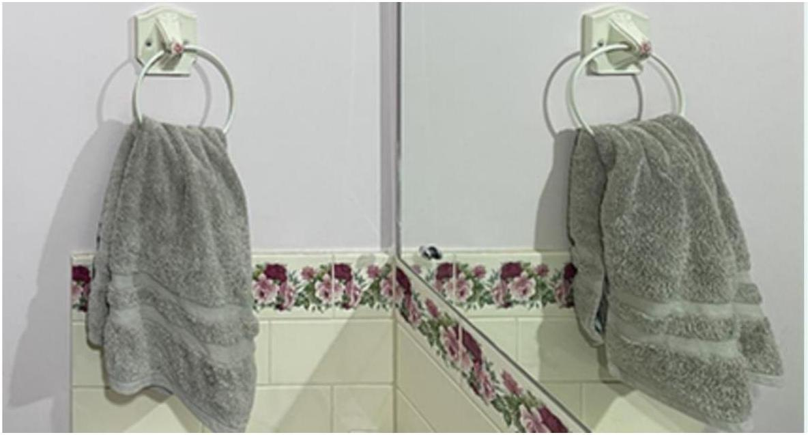

d) When looking at the towel from a different perspective, the image below is seen. Draw on the image to explain the difference in darkness of the two shadows, and how each is formed. You may also annotate your diagram with short phrases.

Page 19 of 21
2021 Australian Science Olympiad Examination - Physics
©Australian Science Innovations ABN 81731558309

## Section F: Double glazing

## Suggested time: 18 minutes

Windows are a part of a building which is responsible for considerable heat loss in cold conditions. In cold areas, many buildings are designed with double glazing so that it is possible to keep the building warm without using as much energy to do so. Double glazing also significantly reduces the transmission of sound through windows and so is used in situations where a high level of sound insulation is required.

There are many different types of double glazing and one of the more effective types is vacuum double glazing. In vacuum double glazing two sheets of glass are separated by a space with substantially reduce air pressure. The two sheets of glass are held apart by supports, which must be made of a clear material and not be visible to the unaided eye.

There are four requirements for double glazing,

1) It must meet the safety requirements around breakage, and must not break too easily.
2) It should reduce the flow of heat considerably.
3) It should transmit high amounts of visible light with little change of colour.
4) It should reduce the transmission of sound significantly.
a)
    i) Identify two factors which will significantly change the level of transmission of sound through the double glazing.
    ii) Describe a method to compare the level of sound transmission through the double glazing as you change one of these factors.

b) A group of students modifies a fridge door so that a piece of glass or double glazing can be mounted in the door, acting as a window between the fridge and the surrounding room.

In order to test the rate of heat flow through a range of double-glazing types, the glass is mounted in the fridge door and the fridge is turned on until it is cold. At the same time, the room is heated to a chosen temperature. Once both are at temperature, both the room heating and fridge are turned off. The time taken for the temperature in the fridge to increase by 5°C is measured.

i) Do these measurements provide information which allows you to compare different types of double glazing?
ii) What are the largest sources of error in these measurements, and are there any small modifications to the procedure, or additional steps which the students could take, which would significantly reduce the sources of error.

END OF EXAM
