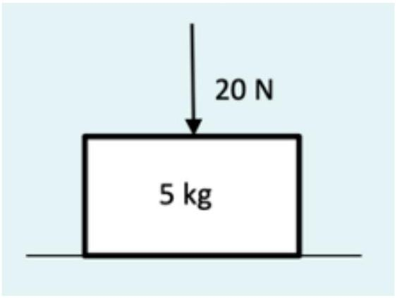

3. A block of mass 5 kg sits at rest on a horizontal surface. A downwards force of 20 N is applied to the block, as shown.

What is the weight of the block? Select one:
    A. 5 kg
    B. 25 kg
    C. 25 N
    D. 50 N
    E. 70 N
