11. This measurement technique allows us to determine what elements are present in a material, and also in what ratio. Consider three common oxides of iron: wüstite (FeO), magnetite $\left(\mathrm{Fe}_{3} \mathrm{O}_{4}\right)$, and hematite $\left(\mathrm{Fe}_{2} \mathrm{O}_{3}\right)$. Determine which of the three spectra below correspond to each oxide of iron, explaining your reasoning with words and calculations. Note that in the graphs below, the red and green lines show the contribution of each element towards the total spectrum. For this problem let $\theta=175^{\circ}$ and $E_{0}=5.486 \mathrm{MeV}$. (6 marks)

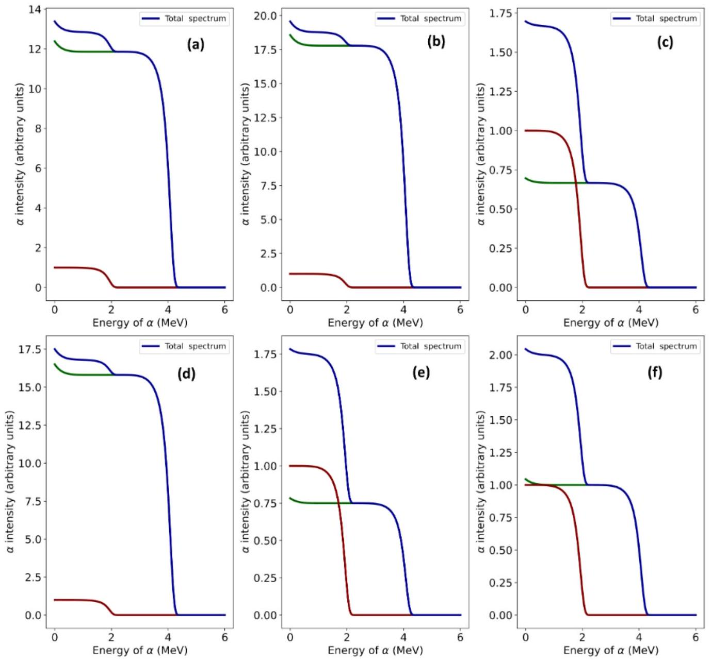
Page 16 of 23

| 1   1 IA 1A   H   Hydrogen 1.008 | 2 IIA 2A   Periodic Table of the Elements   13 IIIA 3A |  |  |  |  |  |  |  |  |  |  |  |  |  |  |  |  |  |  |  |  | 18   18   18 VIIIA 8A |
| :--- | :--- | :--- | :--- | :--- | :--- | :--- | :--- | :--- | :--- | :--- | :--- | :--- | :--- | :--- | :--- | :--- | :--- | :--- | :--- | :--- | :--- | :--- |
|  |  |  |  |  |  |  |  |  |  |  |  |  |  |  |  |  |
|  |  |  |  |  |  |  |  |  |  |  |  |  |  |  |  |  |  | 14 IVA 4A |  | 16 VIA 6A | 17 VIIA 7A | Lu Lu   Lutetium 174.967 |
| 3   Li   Lithium 6.941 | 4   Beryllium 9.012 |  |  |  |  |  |  |  |  |  |  |  |  |  |  |  |  |  |  |  |  |  |  | 10.811   6   6   C   Carbon 12.011 | 7   N   Nitrogen | 8   8   Oxygen   Oxygen 15.999 | 9   F   Fluorine 18.998 | 10   Ne   Neon 20.180 |
| 11   Na   Sodium 22.990 | 12   Magnesium 24.305 | 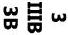 | 4   4 IVB IVB 4B 4B | 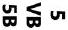 | 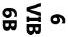 | 7   7 VIIB VIIB 7B 7B | 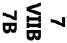 |  | 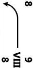 | 8   8 VIII 8 8 |  |  | 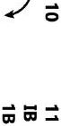 | 10   10 IB 1B 1B | 12 IIB 2B 2B | 13 26.982   14 |  | 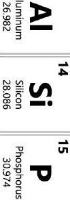 |  | Si   Silicon 28.086   15   P   Phosphorus 30.974   16   S   Sulfur 32.066 | 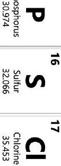 | 17   17   Cl   Chlorine   18   Ar   Argon |
| 19   K   Potassium 39.098 | 20   Ca   Calcium 40.078 | 21   Scandium 44.956 | 22   22   Titanium 47.867 | 23   23   Vanadium 50.942 | 24   24   Chromium 51.996 | 25 Mn   Manganese 54.938 | 26 Fe   Iron 55.845 |  |  | 27 Co   Cobalt 58.933 |  | 28   28 Ni   Nickel   Nickel 58.693 |  | 29 63.546 | 30   30 Zn   Zinc 65.38 | 31   31   Ga   Gallium 69.723 |  | 32   32   Ge   Germanium 72.631 | 33   33 As   Arsenic 74.922 | 34   34   Se   Selenium 78.971 | 35   35   Br   Bromine 79.904 | 36   Kr   Krypton 83.798 |
| 37   Rb   Rubidium 85.468 | 38   Sr   Strontium 87.62 | 39 rtrium 88.906 | 40   40 Zr   Zirconium 91.224 | 41 Niobium 92.906 | 42 Molybdenum 95.95 | 43 Tc   Technetium 98.907 | 44 Ruthenium 101.07 |  |  | 45 Rh   Rhodium 102.906 |  | 46 Palladium 106.42 |  | 47 Ag   Silver 107.868 | 48 Cd   Cadmium 112.414 | 49 In   Indium 114.818 |  | 50 Sn   Tin 118.711 | 51 Sb   Antimony 121.760 | 52 Te   Tellurium 127.6 | 53   53 I   Iodine 126.904 | 54   54 Xe   Xenon 131.294 |
| 55   55   Cs   Cesium 132.905 | 56 Ba 137.328 137.328 | 72 | Hafnium 178.49 | 73   73 Ta   Tantalum 180.948 | 74 Tungsten 183.84 | 75   75 Rhenium Rhenium | 186.207 | 76 Os   Osmium 190.23 |  | 77 Iridium Iridium 192.217 | 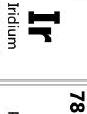 | 78   78 Pt Platinum Platinum | 195.085 | 79   79 Au Gold   Gold | 196.967 | Hg Mercury 200592 | 81   81 TI   Thallium 204.383 | 82 Pb   Lead 207.2 | 83 Bismuth 208.980 | 84 Po   Polonium [208.982] | 85 At Astatine   Astatine 209987 | 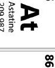 |
|  | 88 226.025 226.025 226.025 | 89-103 | 87   87   87   Fr   Francium 223.020 | 105 Db Dubnium [262] [262] | 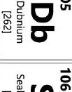 | 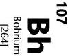 | 107   107 Bohrium Bohrium [264] [264] | 108   ${ }^{108}$ Hs Hs | Hassium [269] |  | 109 Meitnerium Meitnerium Meitnerium [278] |  | 110 Darmstadtium [281] | 111 Roentgenium [280] | 112 Cn Copernicium [285] | 113 Nh Nihonium Nihonium [286] |  | 114 Flerovium [289] | 115 Mc Moscovium [289] | 116 Lv Livermorium Livermorium [293] | 117 Ts Tennessine [294] | 118   118 Og Oganesson [294] |
|  |  |  | Lanthanide   Lanthanide |  |  |  |  |  |  |  |  |  |  |  |  |  |  |  |  |  |  |  |
|  | Actinide Series Series Series | 89   89 | Ac | 90 Th Thorium 232.038 232.038 | 91 | 92 Uranium 238.029 | 93 Np Neptunium 237.048 |  | 94 Plutonium 244.064 |  | 95 Am Americium 243.061 243.061 |  | 96 Cm Curium 247.070 247.070 | 97 Bk Berkelium 247.070 247.070 | 98 Cf Californium Californium 251.080 251.080 251.080 |  |  | 99 Einsteinium Einsteinium [254] [254] [254] | Fm Fm Fermium 257.095 257.095 257.095   101   101 | Md Mendelevium Mendelevium 258.1 258.1 | 102 No Nobelium 259.101 259.101 259.101 | 103 Lr Lr T [262] [262] [262] [262] |

## Section D: Seeing Secchis

## Suggested time: 30 minutes

A Secchi disk is a tool used to measure the turbidity (cloudiness) of a body of water. It consists of a disk split into quarters alternatingly painted black and white. The disk is lowered into the water until the 'secchi' depth at which it can no longer be seen. 'Attenuation' is a measure of how light decreases with depth in the water. In this question students would need to determine the factors affecting the secchi depth and methods to calculate the attenuation coefficient of the water from the secchi depth. These factors will include the light level and contrast level the black and white.

This is a Secchi disk:

Figure 1: A Secchi Disk

If you lower it deeper and deeper underwater it will get to a point where you can no longer distinguish between the white and black sections. Why? Because light 'attenuates' through water. Attenuation is a measure of how light intensity decreases as it passes through a medium. As the disk gets deeper, so much light will be lost through the water that we can no longer distinguish the black and white disks. This process occurs at relatively shallow depths due to the ambient light, in this case light reflected off the water.

Attenuation of light can be calculated using the Beer-Lambert Law:

$$
I=I_{0} e^{-\mu z},
$$

where:

- $\mu$ is the attenuation coefficient of the fluid, a measure of how quickly the light level decreases. $\mu$ is a measure of turbidity.
- $e$ is the Euler number = 2.71828
- $z$ is the path length of the light through the fluid
- I is the intensity of the light observed once the light passes through a path length of fluid $z$
- $I_{0}$ is the initial intensity of the light source.

However, if there is an ambient light intensity, $I_{f}$, then the light intensity will not decay to zero but instead to the ambient level as shown in the equation below:

$$
I=\left(I_{0}-I_{f}\right) e^{-\mu z}+I_{f}
$$

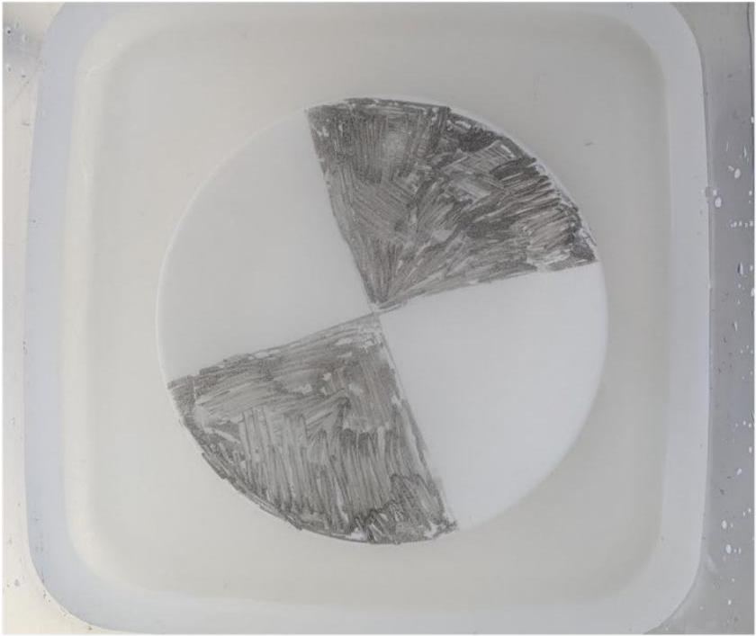
Secchi Disk in Water Tank

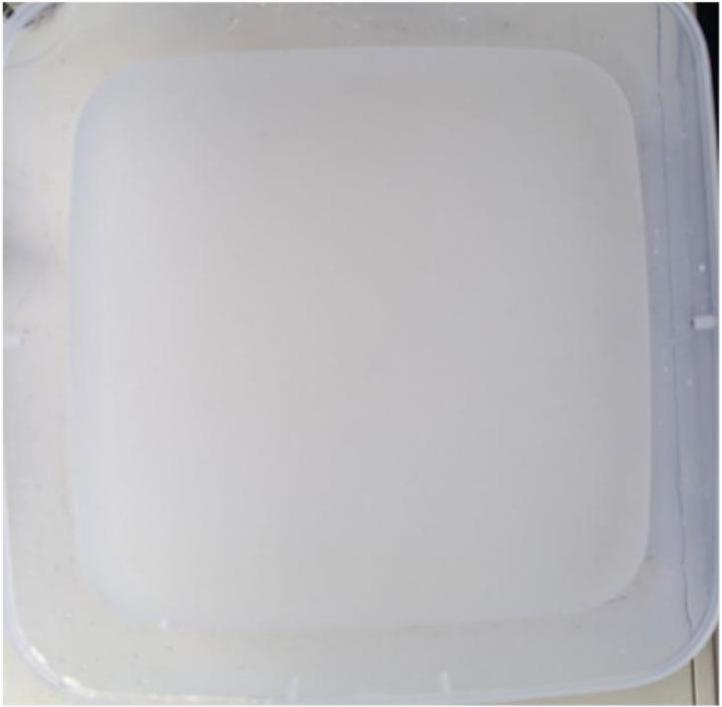
Ambient light reflected off cloudy water has nonzero intensity
