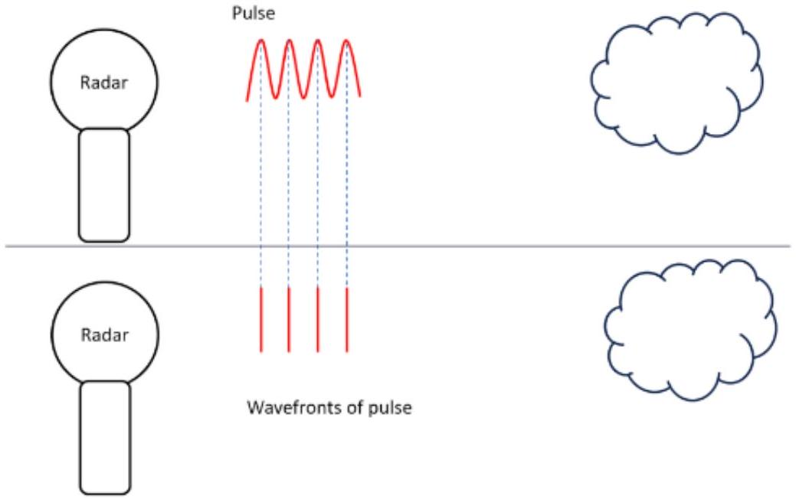
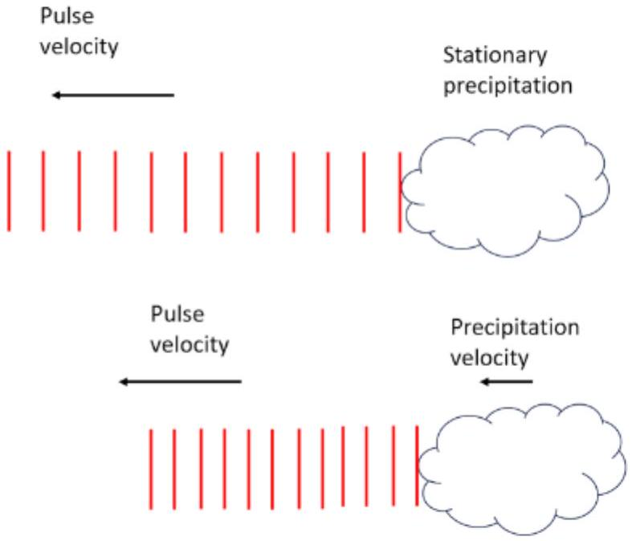
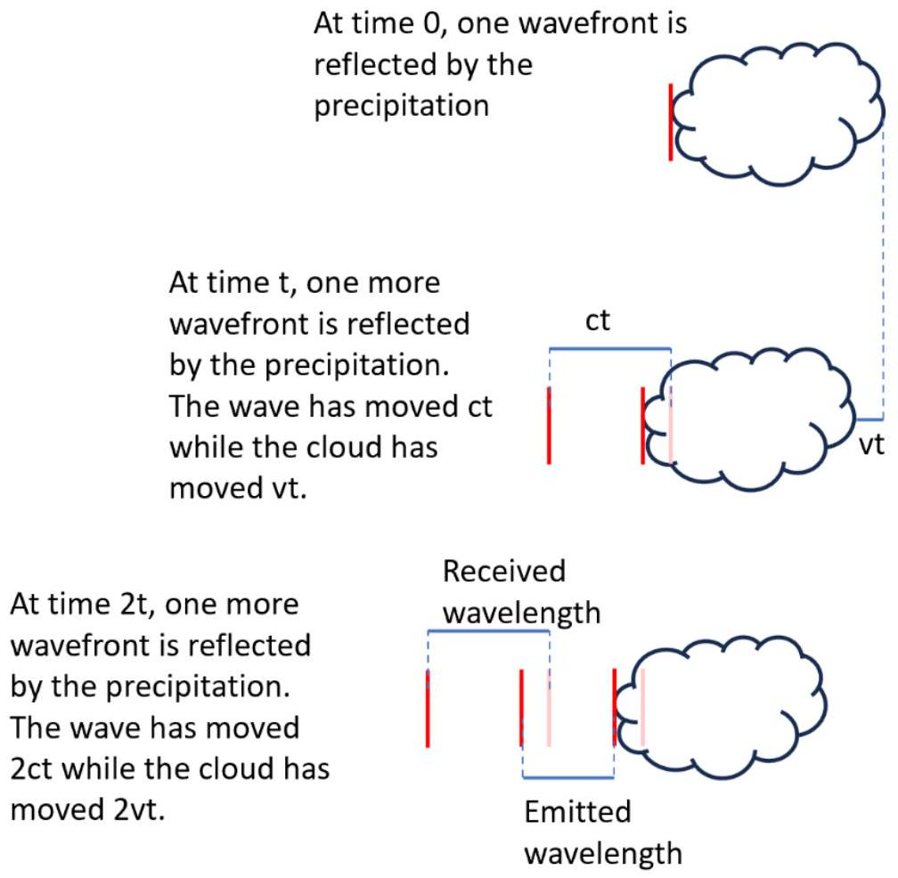

11. The weather radar sometimes displays the signal of patches of light rain behind bands of heavy rain, even when this light rain is not present. Explain what causes this, including any relevant diagrams. (5 marks)

Some very sensitive weather radars are also able to detect changes in frequency between when the pulse is emitted and received. The frequency (Hz) is the number of waves that pass through a fixed point in one second. This means that the radar can be used to determine the speed of the wind and precipitation.

When the pulse is incident on moving precipitation, the precipitation moves slightly between receiving each wavefront and then moves again slightly between reflecting each wavefront. This means that the wavelength (distance between wavefronts, $\lambda$ ) of radiation which it reflects is different to the wavelength of radiation emitted by the radar. Since the speed of light $c=2.997924580 \times 10^{8}$ $\mathrm{m} / \mathrm{s}$ is constant in air and $c=f \lambda$, a shorter wavelength leads to a higher frequency $(f)$ and a longer wavelength to a lower frequency.

Change of frequency after reflection

In general, the observed frequency due to relative motion between the radar and cloud at speeds much lower than the speed of light can be calculated with the formula:

$$
f^{\prime}=f \frac{v \pm v_{O}}{v \pm v_{S}},
$$

where:

- $f$ is the original frequency,
- $f^{\prime}$ is the new frequency,
- $v$ is the speed of light,
- $v_{O}$ is the speed of the observer, and
- $v_{S}$ is the speed of the source.
