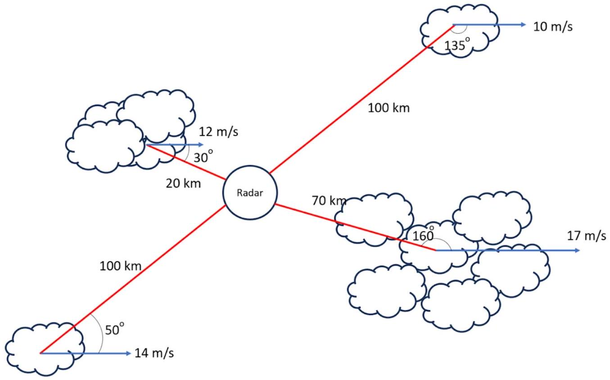

14. Calculate the received frequency by the radar for precipitation moving at $10.000000000 \mathrm{~km} / \mathrm{h}$ away from the radar. The radar emits a pulse of frequency 5.600000000 GHz. Give your answer to 10 significant figures and use $\mathrm{c}=2.997924580 \times 10^{8} \mathrm{~m} / \mathrm{s}$ (1 mark).

Weather Pattern used in Questions 14-17
