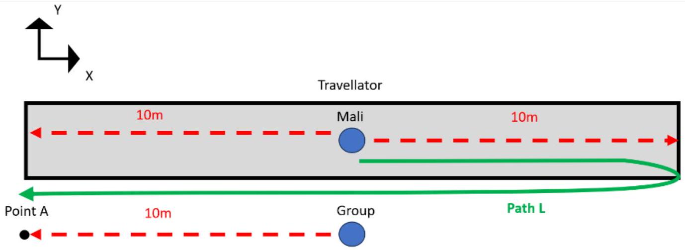

3. The group moves at 1.0m/s towards the left. The travellator moves at 0.70m/s towards the left. Mali walks at a constant speed v relative to the ground/travellator beneath them. Mali wants to take path L and arrive at point A at the same time as the rest of the group. At what speed should Mali move? Ignore any distance travelled in the y-direction for this problem. (4 marks)

