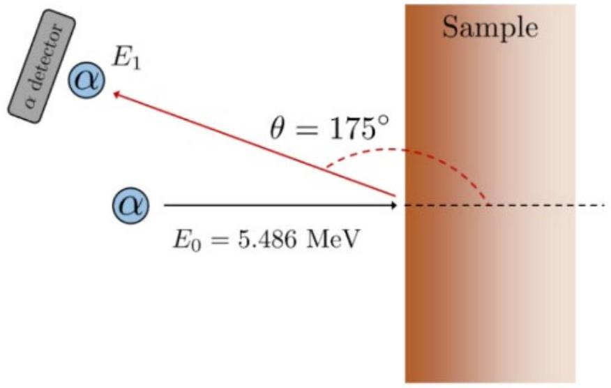

8. Instead, consider now that you have an oxygen-16 beam. Is it possible to determine the relative amounts of calcite and dolomite in a sample where they are mixed? Assume that we know the sample only contains these two compounds. (2 marks)

Using the same experimental set-up above, now assume that there is a probing source of $\alpha$ (alpha) particles. This is shown in Figure 3 below. $\alpha$-particles are simply helium-4 nuclei (i.e. no electrons, just the nucleus). These $\alpha$-particles are produced by an Americium-241 source, which then undergoes alpha decay. The alpha decay process produces alpha particles with an energy of 5.486 MeV.

Figure 3: Schematic of experimental set-up, for the $\alpha$-particle scattering.
