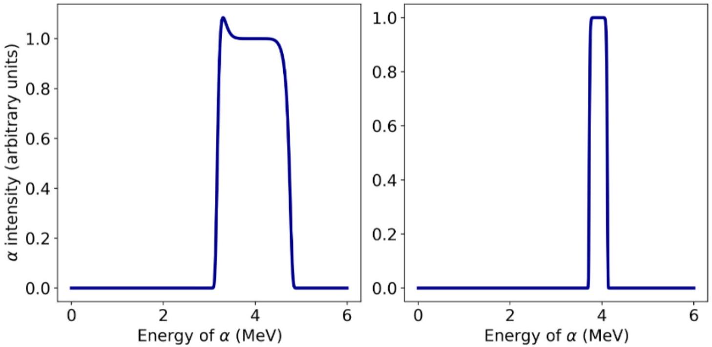

9. Let's say you have two pieces of elemental, grey metal. One is a thick piece, and the other is thin. You know one is composed of iron, and one is tin, but you've forgotten which is which! Luckily, you have made measurements of the scattered $\alpha$-particles using the experimental apparatus shown in Figure 3. Shown below in Figure 4 are the energy spectra obtained from each sample. The x-axis is the energy of the scattered $\alpha$-particle, measured at an angle $\theta=$ 175°. The y-axis is proportional to the number of $\alpha$-particles measured with that energy. Which graph corresponds to which element, and which is the thicker piece? Explain your reasoning with calculation and words. (4 marks)

Figure 4: Energy spectra for tin and iron. Note MeV stands for megaelectron volt, a convenient unit for measuring the energy of atoms.

While we can find the energy of the scattered particle for a given angle, this gives no information about the probability of scattering into that angle. Because the $\alpha$-particles are charged ( +2 ), and they scatter off nuclei which are also charged, this changes the probability of scattering into a particular angle. This probability is approximately given by:

$$
P\left(\theta, m_{2}\right) \approx\left(\frac{Z_{1} Z_{2} e^{2}(1+\gamma)}{4 E_{0}}\right)^{2} \frac{1}{\sin ^{4}(\theta / 2)} \frac{\left(1+\gamma^{2}+2 \gamma \cos \theta\right)^{3 / 2}}{1+\gamma \cos \theta}
$$

Technically, this is not a probability, but is proportional to the probability to scatter into an angle $\theta$. Here, $Z_{1}$ and $Z_{2}$ are the charges of the nuclei (proportional to the number of protons in the nuclei), $m_{1}$ and $m_{2}$ are the masses of the nuclei, and $\gamma=\frac{m_{1}}{m_{2}}$.
