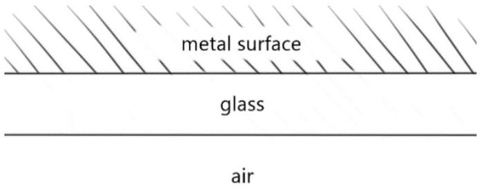
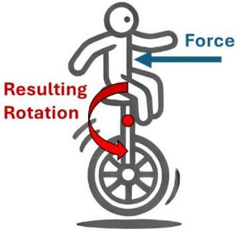
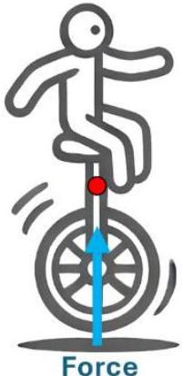

1. Explain using a drawing of light ray paths how these three reflections may have been formed. You may wish to use a diagram similar to the one below. (5 marks)

## Section E: Twisting Torques and Leaning Lego

## Suggested time: 25 minutes

When studying Newton's laws you will have learned that for an object to remain at rest, the forces on it must be balanced. However it is possible for an object with balanced forces on it to twist. There is a rotational equivalent of force that we use to determine if an object will twist or rotate which is called torque.
For this question we will define a clockwise torque as a torque which makes the unicycle-human system rotate clockwise.
For the following questions we will think about torques around the centre of a unicycle-human system. In the two diagrams below there are two unicyclists both with a single force depicted.

The force on the left unicyclist is an anticlockwise torque around the red dot (centre of the unicycle human system). The force on the right unicyclist points directly at the red dot therefore there is no offcentre force and no torque. For each of the unicyclists in the questions below determine whether the force depicted corresponds to a clockwise torque, an anti-clockwise torque or no torque with respect to the red dot.
