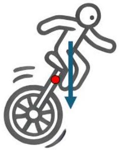
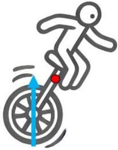
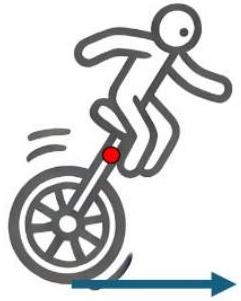

1. For each of the three diagrams below indicate whether the force on the unicyclist corresponds to a clockwise, anti-clockwise torque or no torque. (3 marks)

The torque caused by a force is given by the following formula: $\tau=\mathrm{rF} \sin (\theta)$
Where: $\tau$ is the magnitude of the torque, r is the distance between the point about which we are calculating the torque and the force's location on the object, F is the magnitude of the force. $\theta$ is the angle between the force F and a line joining the force's position to the position around which we are calculating the torque. Note that this means it is possible for a small force to have an equal torque to a large force if the smaller force is significantly further away.

A free body diagram is a diagram where the forces are represented as straight arrows. The size of the arrow should roughly indicate the size of the force. If you wish to use an arrow to represent the direction of motion or acceleration make sure that it is clearly labelled and separate from the rest of the diagram.

Newton's Laws state that if an object has a net force it will accelerate. Similarly if an object has a net torque (around any point) then it will start to rotate or change its rotational velocity. If a unicyclist has an unbalanced torque then the unicycle will start to fall over (not desirable).
