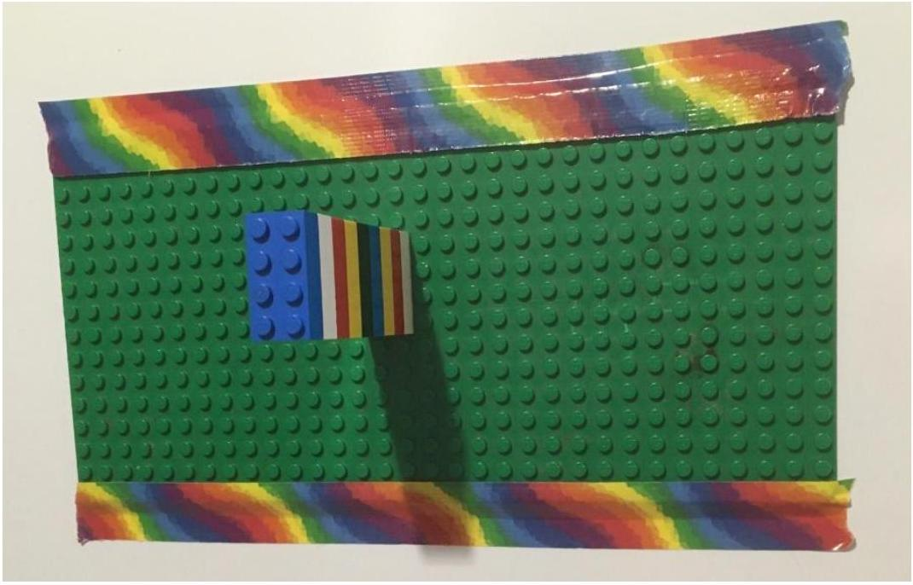
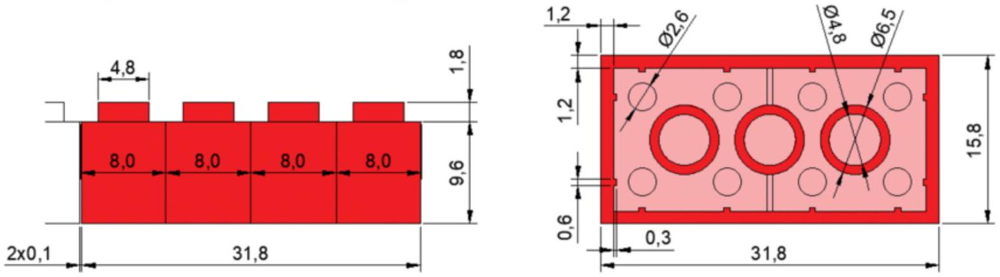

2. With this in mind, draw a free body diagram of the unicycle/ unicyclist system in each of the following circumstances. State whether the forces are balanced and whether the torques are balanced. (6 marks)
    a. The unicycle and rider are stationary.
    b. The unicycle and rider while moving at constant velocity.
    c. The unicycle and rider while accelerating forwards.

The next part of this question is called Leaning Lego Logic. It uses the information that you learned about torque from the previous parts of the question.

You suddenly decide that you are interested in determining the coefficient of static friction of Lego. So you tape a Lego baseplate to your fridge (using rainbow duct-tape) and start stacking 2x4 bricks outwards as shown in the image below.

You also accurately measure the brick weight (2.32 g) and dimensions. The dimensions of the Lego bricks are given in millimeters in the diagram below.

The cylindrical bumps that are on top of the Lego bricks are called studs.

Your plan is to find out how many bricks it takes before the horizontal 'tower' falls down. Assume that acceleration due to gravity is $9.8 \mathrm{~m} / \mathrm{s}^{2}$.
