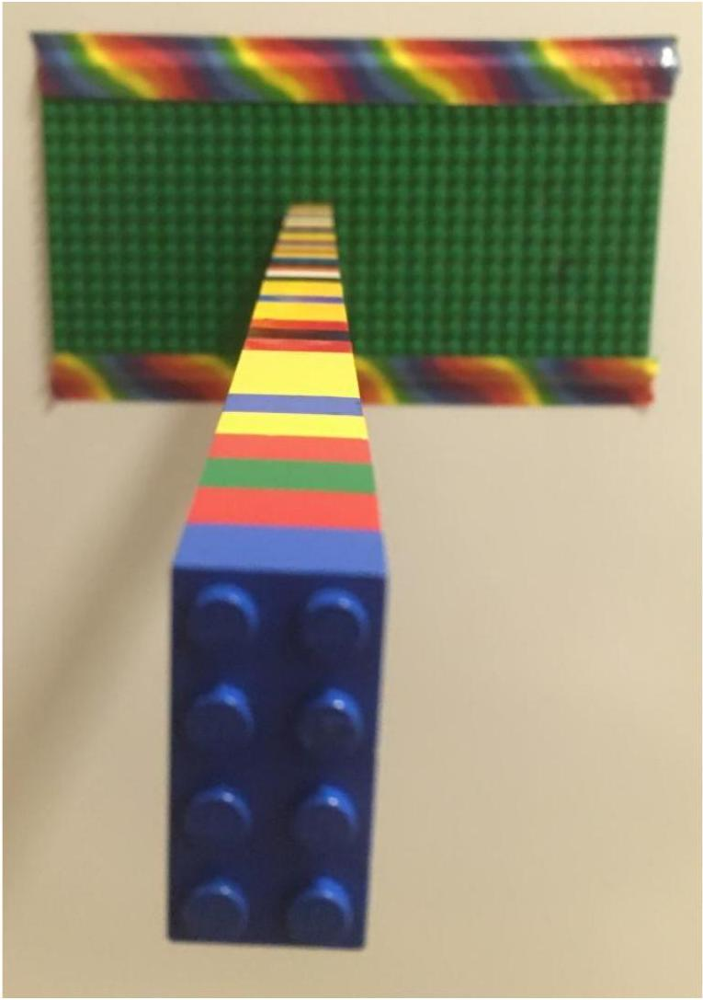

4. Imagine you kept making the horizontal tower longer and longer until it collapsed under its own weight. Where in the tower do you expect it to fail (break)? Justify your answer. (3 marks)

You are impressed with how strongly these bricks hold!

You find that the horizontal tower was able to hold 44 Lego bricks before collapsing.
