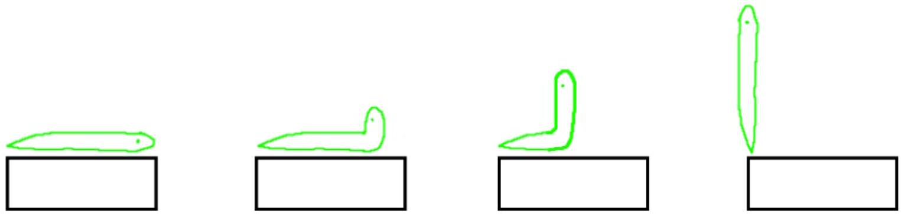

7. Electricity prices are skyrocketing to \$0.44 per KiloWatt hour (kWh). How much will the electricity cost to dig this hole using the machine (in dollars)? What fraction is this of the tradie's wage (\$100 per hour)? (3 marks)

## Section B: Slithering Snake

Suggested time: 30 minutes
A class is asked to investigate and model the motion of snakes.
Student A sees a video of a snake rising to stand on the tip of its tail in the following way.

They are curious about what would happen if the snake did this on an electronic scale. They decide to model the snake as cylinder of mass $\mathrm{m}=1.0 \mathrm{~kg}$ and length $\mathrm{L}=1.3 \mathrm{~m}$ with a uniform mass distribution.
