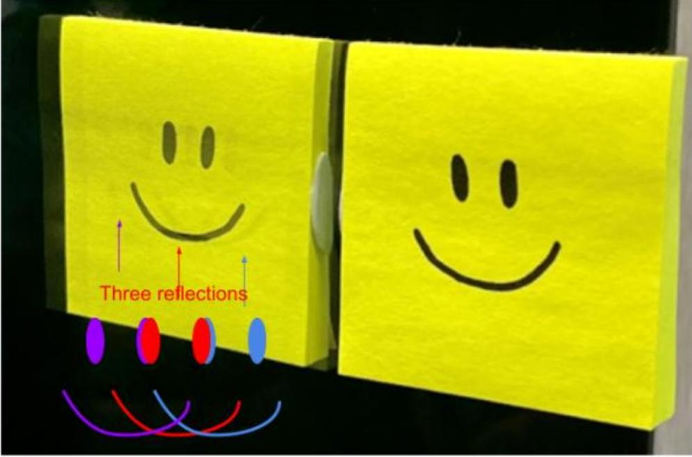

8. Find a relationship between the note number N and the frequency f in Hz in terms of $\mathrm{f}_{0}$. What frequency in Hz would the note 27 correspond to? (5 marks)

## Section D: Reflection Replicas

## Suggested time: 5 minutes

Jane was looking in the mirror one day when she noticed that her reflection had two very faint copies:

This means that in total there are three reflections, these are made clearer in the diagram below:

Her mirror is made up of a layer of glass backed by a reflective metal layer, as shown in the question below. The glass reflects about 4\% of the light that hits its surface, and transmits the rest into/out of the mirror.
