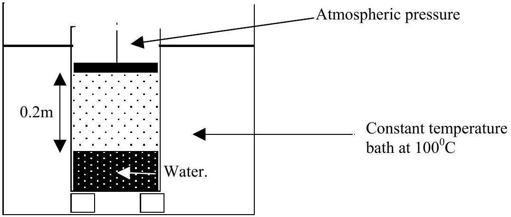

Q2
a) Write down an energy equation expressing the first law of thermodynamics. Define all the terms in the equation. [5]
b) Water in an electric kettle is brought to the boil in 180 s by raising its temperature from $20^{\circ} \mathrm{C}$ to $100^{\circ} \mathrm{C}$. It then takes a further1200 s to boil the kettle dry. Calculate the specific latent heat of vaporisation of water, $L$, at $100^{\circ} \mathrm{C}$. The specific heat capacity of water is $4200 \mathrm{~J} \mathrm{~kg}^{-1} \mathrm{~K}^{-1}$.
State any assumptions made. [4]
c) A cylinder, with a weightless piston, has an internal diameter of 0.24 m. The cylinder contains water and steam at $100^{\circ} \mathrm{C}$. It is situated in a constant temperature bath at $100^{\circ} \mathrm{C}$, Figure 2.1. Atmospheric pressure is $1.01 \times 10^{5} \mathrm{~Pa}$. The steam in the cylinder occupies a length of 0.20 m and has a mass of 0.37 g.

Figure 2.1

Figure 2.1

(i) What is the pressure $P$ of the steam in the cylinder?
(ii) If the piston moves very slowly down a distance 0.10 m, how much work, W, will be done in reducing the volume of the system?
(iii) What is the final temperature, $T_{\mathrm{f}}$, in the cylinder?
(iv) Determine the heat $Q_{\mathrm{c}}$ produced in the cylinder.
d) A molecule of oxygen near the surface of the Earth has a velocity vertically upwards equal in magnitude to the root mean square (rms) value. If it does not encounter another molecule, calculate:
    (i) the height $H$ reached if the surface temperature is 283 K
    (ii) the surface temperature $T_{\mathrm{s}}$ required for the molecule to escape from the Earth's gravitational field if the potential energy per unit mass at the Earth's surface is $\left(-\mathrm{GM}_{\mathrm{E}} / \mathrm{R}_{\mathrm{E}}\right)$.

The oxygen molecule has a molar mass of 0.032 kg . [5]
