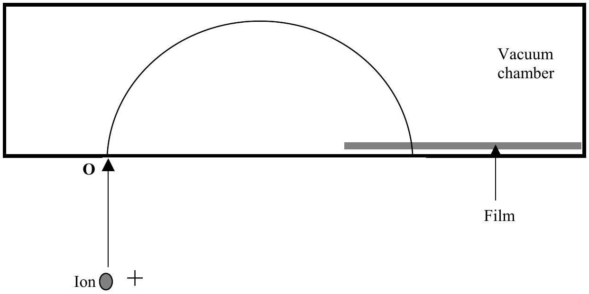

Q4

Figure 4.1

Figure 4.1
A mass spectrometer measures the mass $m$ of ions. An ion, charge $Q$, is accelerated to a high speed $v$. It is injected at right angles to OP at O, Figure 4.1, into a region with a uniform magnetic field B which is perpendicular to the initial velocity of the ion. The ion will impact on the photographic film at P. By measuring the distance OP the mass of the ion can be determined. The spectrometer is contained in a vacuum chamber.
a) Show that:
    (i) the path of an ion is circular and state the direction of the magnetic field
    (ii) the radius $R$ of the circle is given by
$$
R=m v /(B Q) .
$$
$\square$
b) Singly charged ions of $\mathrm{K}_{19}^{39}$ and $\mathrm{K}_{19}^{41}$ are accelerated through a p.d. of 500V and injected into the mass spectrometer with a magnetic flux density $B=0.70 \mathrm{~T}$.
    (i) What is the speed $v_{i}$ of the ions injected into the spectrometer?
    (ii) Determine the speed at which the ions hit the film, $v_{f}$.
    (iii) Calculate the distance OP for each ion.

c) (i) If the accelerating voltage fluctuates within a range $(500 \pm 5) \mathrm{V}$, obtain the spread in OP for each ion.
Determine if the spectrometer can distinguish between the two ions.
    (ii) How will a small variation in the incident direction of the ions, for constant $v_{\mathrm{i}}$, affect their trajectories?
