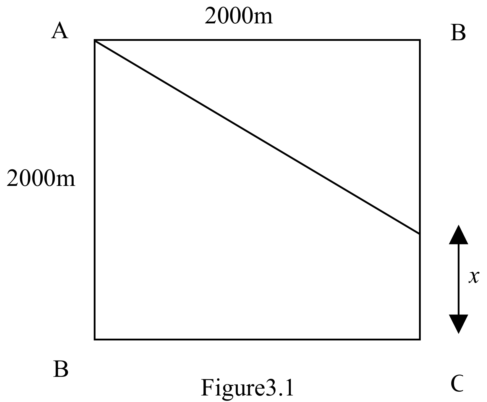

a) Two identical synchronously oscillating dippers separated by a horizontal distance $l= 3.0$ m, with a period of 1.00 s, produce waves on a smooth lake that travel at a speed of $1.2$ ms$^{-1}$. The centres of the waves are at A and B. O is the mid point of AB.

(i) Draw a scale diagram of the wave fronts present after 4.00 s.
(ii) What conditions must be satisfied for constructive and for destructive interference of the water waves, at a point which is a distance $x$ from A and distance $y$ from B?
(iii) Mark, in the diagram, the regions where constructive and destructive interference occur.
(iv) P is a point at a large distance, compared with $l$, from A and B, at an angle $\theta = $ POB. What are the conditions for constructive and destructive interference at $P$?

[10]

b) A boat crosses a smooth lake at a speed of 5.0 m s$^{-1}$. Waves on the lake travel at 2.5 m s$^{-1}$. The waves generated by the boat produce a bow wave. This is tangential to the waves created by the boat. What angle, $\phi$, does the bow wave make with the velocity of the boat? Give an explanation of the calculation.

[4]

c) Figure 3.1 shows a horizontal square ABCD with sides of length 2000 m. Coherent 10.0 MHz radio signals, wavelength $\lambda$, are transmitted from A and B.

(i) Calculate the value of $\lambda$.
(ii) What is the path difference $p_B$ for the two signals, from A and B, received at B? Express it in terms of the product $n_B\lambda$ and deduce the value of $n_B$. Repeat the calculation for the point C and obtain the corresponding $p_C$ and $n_C$.
(iii) An observer at C moves towards B, a distance $x$, in the direction CB in order to receive the first signal of maximum strength. Determine $x$.

[6]

Figure3.1
