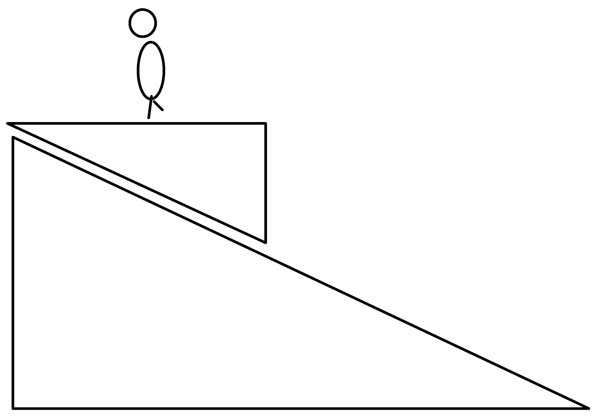
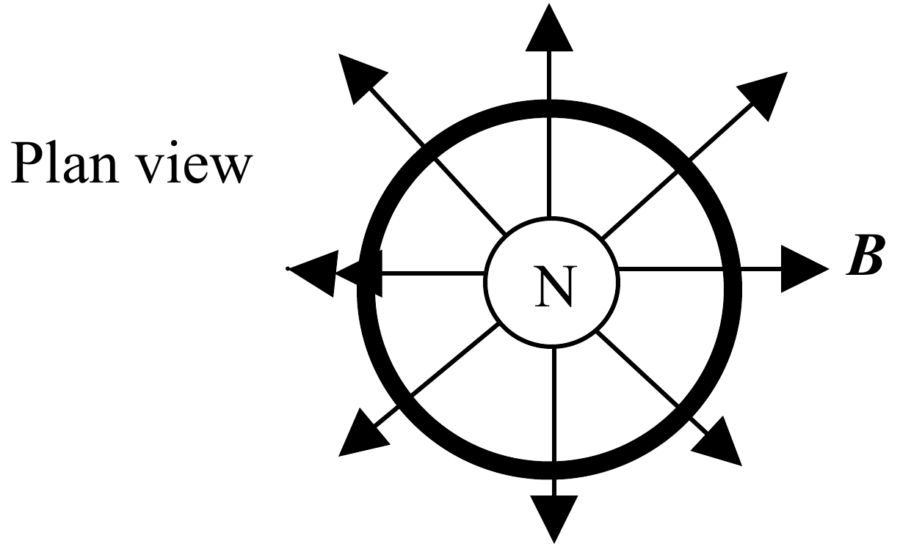

a)

Figure 5.1

A student, mass 80 kg, stands on a horizontal set of bathroom scales, of negligible mass, attached to a massless platform that slides down a 30$^{\circ}$ incline, Figure 5.1. The scales read 75 kg. Calculate:

(i) the vertical acceleration $a_{\mathrm{v}}$ of the student
(ii) the acceleration of the student down the slope $a_{\mathrm{s}}$
(iii) the coefficient of dynamic friction $\mu$ between the platform and the slope, where $\mu$ is the ratio of the frictional force to the normal reaction.

[10]

b) A metal ring of mass $m$, radius $r$ with a small radius of the cross sectional area, and resistance $R$ falls, symmetrically, from rest, at time $t= 0$, in a horizontal radial magnetic field of magnitude $B$, Figure 5.2. At time t it has a vertical velocity $v$, an acceleration $a$ and a current $I$.

Figure 5.2

(i) Show that, due to the rate at which the magnetic flux is cut,

$$
I = 2\pi rBv/R.
$$

(ii) Deduce that

$$
ma = mg - (2\pi rB)^{2}v/R.
$$

(iii) Derive the initial variation of $v$ with $t$.

Deduce the terminal velocity of the ring.

(iv) Sketch graphically the variation of $a$ and $v$ with $t$.

[10]
