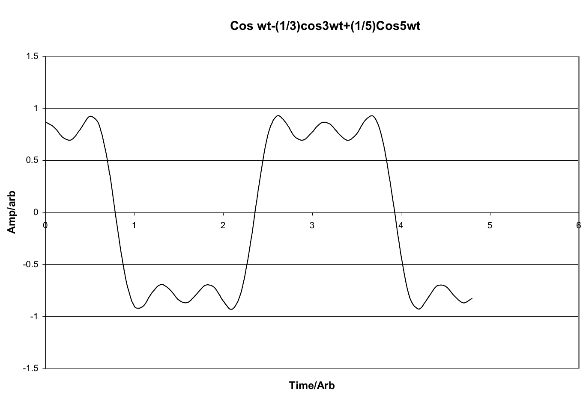
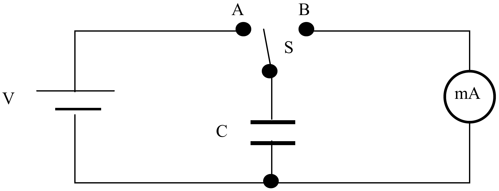

a) Figure 6.1 shows an ideal circuit with a battery, emf $V$, a switch S, an ammeter A of negligible resistance and a capacitor, capacitance $C$. The switch moves continuously from A to B, $n$ times per second, where $n$ is a large integer. Obtain an expression for the average current $I$ registered by the ammeter.

Figure 6.2

Figure 6.1

How would this current alter if a lead resistance $R$ were included with the:

(i) battery? (ii) ammeter?

[7]

b) The expression $F(t) = (4/\pi)\ [\cos\ (2\pi ft)$ - $\square \cos\ (6\pi ft)$ + $\square\ \cos\ (10\pi ft)]$ is an approximation to a *unit* square-wave of frequency $f$ at time $t$, Figure 6.2.

For each cosine term give the

(i) amplitude (iii) phase
(ii) frequency (iv) period

[4]

c) A square-wave voltage, with peak value $V_o$, is applied *separately* across a resistor with resistance $R$ and a capacitor with capacitance $C$. Sketch graphs of the variation with time of;

(i) the current $I$ through the resistor;
(ii) the charge $Q$ on the capacitor.
(iii) Superimpose on these graphs $I$ and $Q$ resulting from the voltage $V_oF(t)$.

[4]

d) A signal generator, resistance $300\,\Omega$, produces a square-wave signal of frequency 1.0 MHz. The output of the generator is connected to an oscilloscope, with negligible capacitance, by a coaxial cable of capacitance $1.5 \times 10^{-9}$ F and negligible resistance. Sketch the trace observed on the oscilloscope screen.

Give any necessary calculations.

[5]
