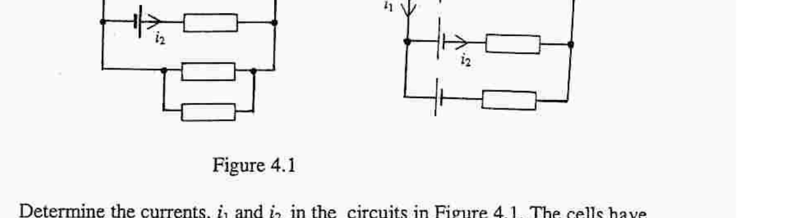
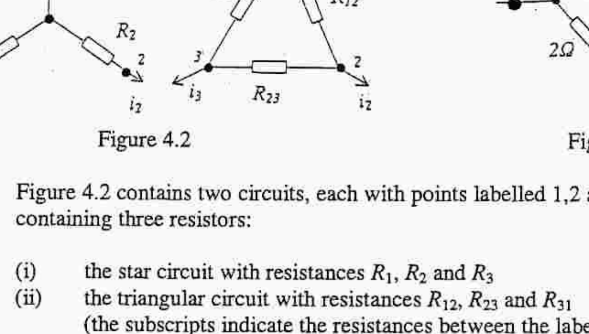
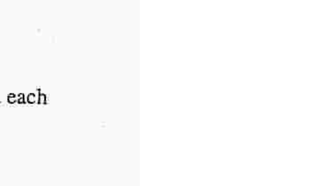

## Q4

Figure 4.1

Determine the currents, $i_{1}$ and $i_{2}$, in the circuits in Figure 4.1. The cells have emf E , with negligible internal resistance, and resistors each of resistance $R$.

Figure 4.2

Figure 4.3

Figure 4.2 contains two circuits, each with points labelled 1,2 and 3, and each containing three resistors:
(i) the star circuit with resistances $R_{1}, R_{2}$ and $R_{3}$
(ii) the triangular circuit with resistances $R_{12}, R_{23}$ and $R_{31}$
(the subscripts indicate the resistances between the labelled points).
The two circuits have identical currents $i_{1}, i_{2}$ and $i_{3}$ and identical potential differences between sets of points $(1,2),(2,3)$ and $(3,1)$.
For $i_{l}=0$ calculate the potential difference across ( 2,3 ) for (i) star and
(ii) triangular networks.

By equating potential differences in the two circuits, show that

$$
\left(R_{2}+R_{3}\right)\left(R_{31}+R_{12}+R_{23}\right)=R_{23}\left(R_{31}+R_{12}\right) .
$$

c) Deduce two further relations by setting (i) $i_{2}=0$ and (ii) $i_{3}=0$.
d) Figure 4.3 contains a triangular arrangement of three $1 \Omega$ resistors. Verify that the resistors in the equivalent star circuit are all $1 / 3 \Omega$.
e) Hence determine the resistance, $R_{\mathrm{AB}}$, between AB .
