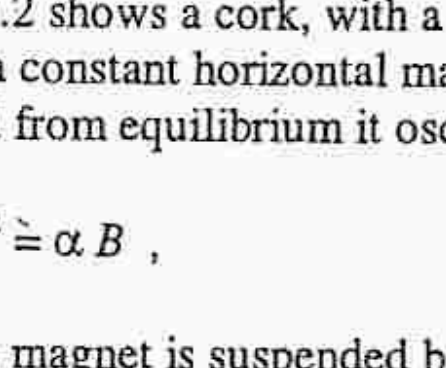
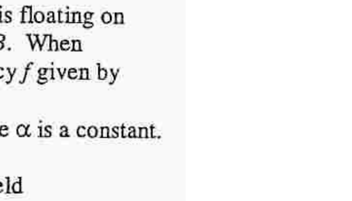

## Q5

a) The magnitude of the magnetic flux density $\mathbf{B}$ at a distance $r$ from an infinite straight wire carrying a current $I$ is given by

$$
\mathrm{B}=\frac{\mu_{o} I}{2 \pi r}, \quad \text { where } \mu_{\mathrm{o}} \text { is the permeability of free space. }
$$

Show that the force per unit length, $F$, between two infinite parallel wires carrying currents $I_{1}$ and $I_{2}$, a distance $r$ apart, is given by

$$
F=\frac{\mu_{o} I_{1} I_{2}}{2 \pi r} .
$$

Indicate the direction of $F$ in a diagram.
b) Sketch the field lines due to two parallel wires, each with current $I$
(i) in the same direction and (ii) in opposite directions.

Draw a graph of the resultant magnetic flux density, $B$, against distance, $x$, along the infinite line through the two wires, in a plane perpendicular to the wires, for cases (i) and (ii).
c) Power line conductors are arranged as a set of three parallel wires, each carrying a current of 200 A in the same direction, and separated from each other by 0.50 m , Figure 5.1.
Determine the force per metre on each wire. Draw a force diagram.

Figure 5.1

Figure 5.2

d) Figures 5.2 shows a cork, with a magnet resting on it, which is floating on water in a constant horizontal magnetic field of flux density $B$. When perturbed from equilibrium it oscillates with angular frequency $f$ given by

$$
f^{2}=\alpha B,
$$

where $\alpha$ is a constant.
When the magnet is suspended by a thread in the magnetic field

$$
f^{2}=\gamma B+\lambda, \quad \text { where } \gamma \text { and } \lambda \text { are constants. }
$$

On what physical property does $\lambda$ depend ?
Describe how to use the latter arrangement to (i) verify that $B$, due to an infinite straight wire, falls off with distance $r$ as $(1 / r)$ and (ii) determine $\lambda$. [4]
