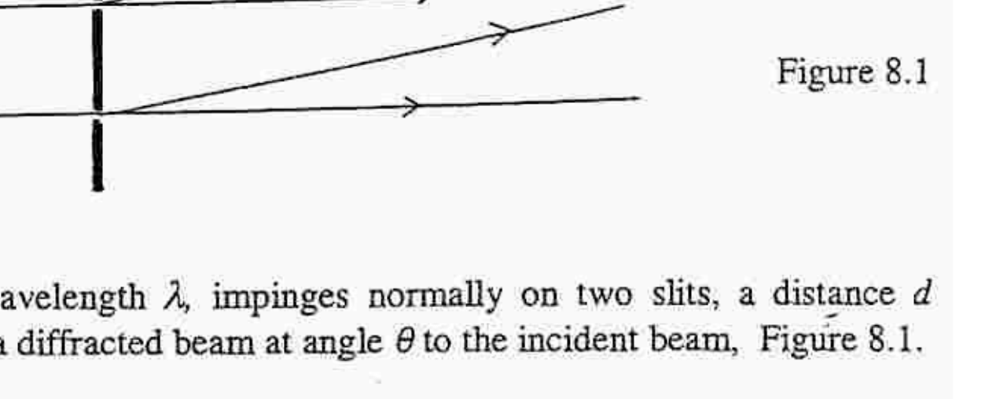
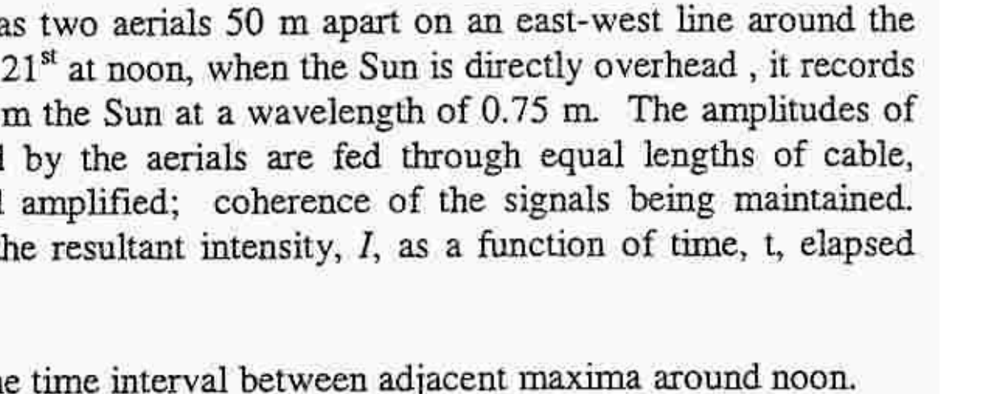

Q8
a) A frequency band of electromagnetic radiation, such as present in white light, is transmitted through a medium. By observing the transmitted radiation, how can one conclude that the refractive index of the medium varies with wavelength?
b)

Figure 8.1

A laser beam, wavelength $\lambda$, impinges normally on two slits, a distance $d$ apart, producing a diffracted beam at angle $\theta$ to the incident beam, Figure 8.1.
(i) What are the conditions for constructive and destructive interference?
(ii) Show that for the first order beam, where $\theta$ less than 0.1 radians, constructive interference occurs when $\theta=\lambda / d$.
(iii) How does the condition in (ii) alter if the system is in a medium of refractive index $\mu$ ?
c)

Figure 8.2

A radio telescope has two aerials 50 m apart on an east-west line around the equator. On March $21{ }^{\text {st }}$ at noon, when the Sun is directly overhead , it records the radio signals from the Sun at a wavelength of 0.75 m . The amplitudes of the signals received by the aerials are fed through equal lengths of cable, added together, and amplified; coherence of the signals being maintained. Figures 8.2 shows the resultant intensity, $I$, as a function of time, t , elapsed after 12 noon.
(i) Determine the time interval between adjacent maxima around noon.
(ii) How would the recording be modified if the observations were performed near Cambridge, England, at latitude $52^{\circ} \mathrm{N}$ ?
d) A pulsar is a rotating neutron star which emits a band of radio frequencies in short pulses. The frequency of the pulses is equal to the frequency of rotation of the star.
(i) The radius of a neutron star can contract. How could one detect this?
(ii) When a cloud of ionised gas passes in front of the star, the refractive index of the interstellar medium changes.
How could an observer detect this cloud?
