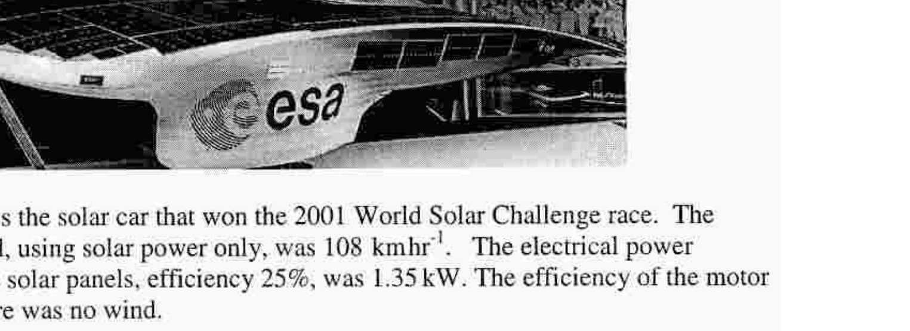
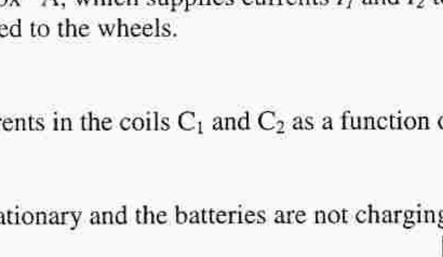

## Q3

A 2.00 m light rigid rod is suspended from the ceiling by two vertical wires, A and B , each having a natural length of $\ell=1.00 \mathrm{~m}$, attached to each end of the rod. A is a copper wire with a Young's modulus $Y_{A}=12.4 \times 10^{10} \mathrm{~Pa}$, diameter 1.60 mm , and B is a brass wire with a Young's modulus $Y_{B}=9.00 \times 10^{10} \mathrm{~Pa}$, diameter 1.00 mm .
a) An 80 kg mass is attached to the midpoint of the rod, calculate:
(i) the tension in each wire, assuming the rod is horizontal
(ii) the consequent extension of A
(iii) the consequent extension of B
(iv) the angle the rod makes with the horizontal
[8]
b) The attachment of the 80 kg mass is moved to a point D , a distance $x$ from A , along the rod.

Calculate:
(i) the extension of A
(ii) the extension of B
(iii) the distance $x$ for the rod to be horizontal.
4.
a) Figure 4.1

Figure 4.1 shows the solar car that won the 2001 World Solar Challenge race. The maximum speed, using solar power only, was $108 \mathrm{kmhr}^{-1}$. The electrical power produced by the solar panels, efficiency $25 \%$, was 1.35 kW . The efficiency of the motor was $97 \%$. There was no wind.
(i) Calculate the total resistive force, $R$, of the car at maximum speed.
(ii) Why was the tyre pressure much greater than that in conventional vehicles?
(iii) Calculate the incident radiant power, $P$, of the Sun on the panels.
(iv) The car has three wheels. What advantage does this give?
b) A series circuit consits of an electrical cell, of $\mathrm{pd} V$ and negligable resistance, and a simple small d c motor consisting of a rotating coil, resistance $r$, and permanent magnets. The motor rotates at angular frequency $\omega$ when the average current is $I$.
(i) Explain why $I$ decreases as the motor speeds up.
(ii) Derive the equation relating $I$ and $\omega$, introducing any appropriate constant.
[4]
c)

Figure 4.2

Figure 4.2 is a diagram of a brushless d c motor used to propel the solar car. The electrical cells are connected to a "black box" A, which supplies currents $I_{1}$ and $I_{2}$ to the coils. The rotor R is a magnet connected to the wheels.
(i) What is the purpose of A?
(ii) Sketch, on the same graph, the currents in the coils $\mathrm{C}_{1}$ and $\mathrm{C}_{2}$ as a function of time $t$.
(d) Why do solar cells overheat if the car is stationary and the batteries are not charging?
