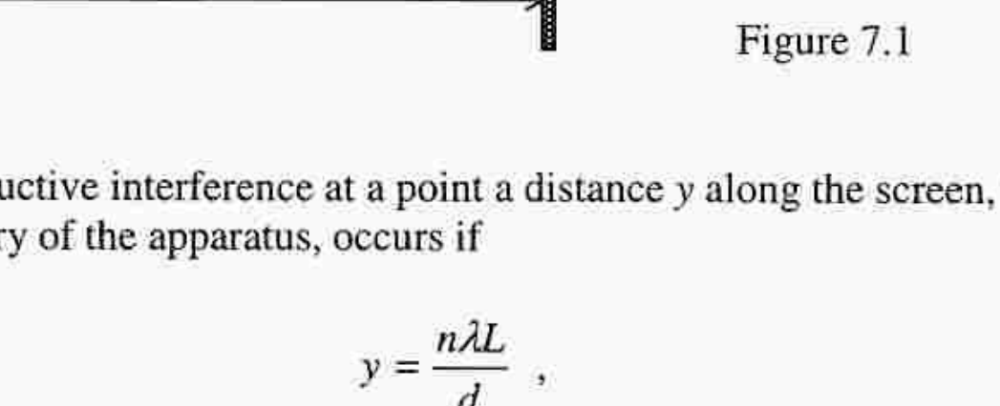
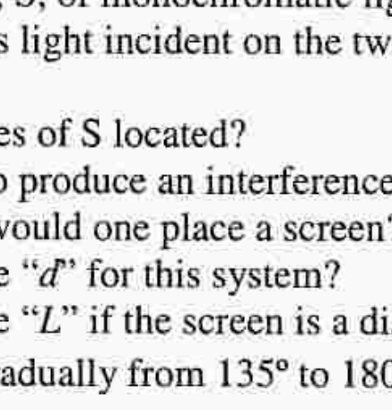

## Q7.

a) A square object is located in front of a plane mirror, in a plane perpendicular to that of the mirror, with one side parallel to the mirror. Draw rays of light reflected by the mirror, from the corners of the square, that enter an observer's eye in the same plane as the square. Indicate the location of the image.
b) A Young's double slit apparatus has a slit separation $d$. The distance between the plane of the slits and that of the screen is $L$, where $L \gg d$, Figure 7.1.

Figure 7.1

Show that constructive interference at a point a distance $y$ along the screen, from the plane of symmetry of the apparatus, occurs if

$$
y=\frac{n \lambda L}{d},
$$

where $n$ is an integer and $\lambda$ is the wavelength of the light.
c)

Figure 7.2

The angle $\mathrm{A} \hat{\mathrm{O}} \mathrm{B}$ between two adjacent mirrors, AO and OB , is $135^{\circ}$, Figure 7.2. AO is vertical. A shielded source, S , of monochromatic light, wavelength $\lambda$, a horizontal distance $p$ from O , produces light incident on the two mirrors only.
(i) Where are the images of S located?
(ii) Why it is possible to produce an interference pattern on a screen?
(iii) In which direction would one place a screen?
(iv) What is the effective " $d$ " for this system?
(v) What is the effective " $L$ " if the screen is a distance $D$ from O ?
(vi) If $\mathrm{A} \hat{\mathrm{O}} \mathrm{B}$ increases gradually from $135^{\circ}$ to $180^{\circ}$, how do the fringes change?
