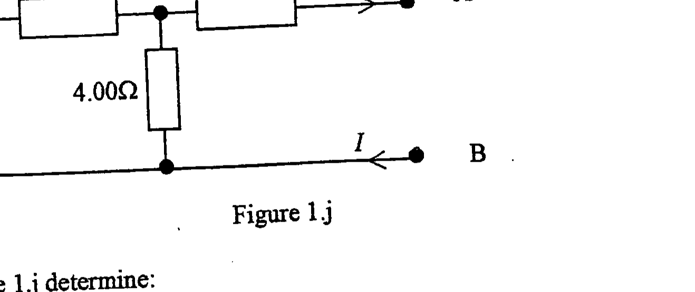

Q1
a) An accurate thermometer, of heat capacity $20.0 \mathrm{JK}^{-1}$, reads $18.0^{\circ} \mathrm{C}$. It is then placed in 0.250 kg of water and both reach the same final temperature of $50.0^{\circ} \mathrm{C}$. Calculate the temperature of the water before the thermometer was placed in it. The specific heat capacity of water is $4200 \mathrm{Jkg}^{4} \mathrm{~K}^{-1}$.
b) The potential in volts, $V$, across a new material varies with the current in amperes, $I$, according to the relation

$$
V=\left(6 I-3 I^{2}+2 I^{3}\right) / 6
$$

from $I=0$ to $I=5$.
Determine the resistance, for (i) $I=2$, and (ii) $I=0$.
For a light bulb and a LED:
(iii) sketch graphs of voltage $V$ against current $I$
(iv) explain the variation in each case.
[6]
c) (i) Why is there a force of net attraction between a charged particle and an uncharged isolated copper sphere some distance away ? Why does this force increase if the sphere is earthed?
(ii) Why can a ladder be leaned at an angle on a rough floor against a smooth wall, but not on a smooth floor against a rough wall?
(iii) Why must a hole in a pinhole camera be neither too small nor too large?
(iv) Why does a blue cloth look dark when viewed in sodium light?
d) (i) Explain why light can be polarized but sound cannot. How would you distinguish, experimentally, between partially and fully polarized light?
(ii) The equation of a wave, with displacement $y$, moving along the $x$-axis at time $t$ is given by

$$
y=A \sin 2 \pi(\beta t-x / \gamma)
$$

where $A, \pi, \beta$ and $y$ are constants.
What are the dimensions or units of $A, \pi, \beta$, and $\gamma$ ?
Why does this equation represent a wave moving with constant velocity?
[7]
e) Wet clothing at $0^{\circ} \mathrm{C}$ is hung out to dry. The air temperature is $0^{\circ} \mathrm{C}$ and there is a dry wind blowing. After some time it is found that some of the water has evaporated and the water remaining on the clothes has frozen. The specific heat of fusion of ice is $333 \mathrm{~kJ} \mathrm{~kg}^{-1}$ and the specific latent heat of evaporation of water is $2500 \mathrm{~kJ} \mathrm{~kg}^{-1}$.
(i) What is the source of energy required to evaporate the water? Explain the mechanism for evaporation.
(ii) Estimate the fraction, by mass, of water originally in the clothing that freezes.
f) A bullet leaves the 1.20 m barrel of a rifle at a horizontal speed of $310 \mathrm{~m} \mathrm{~s}^{-1}$ :
(i) Calculate the acceleration of the bullet in the barrel assuming it to be constant.
(ii) If the bullet emerges from the barrel after two complete rotations, estimate its final rotational speed in radians per second.
(iii) What advantage has a barrel that causes the bullet to rotate?
(iv) In practice the acceleration of the bullet is not constant. Sketch a graph of the expected variation, with distance, and explain the variation.
g) (i) A helium balloon has a volume of $512 \mathrm{~m}^{3}$. What is the largest mass that can be raised by the balloon at STP if the balloon has negligible mass?
(ii) A child, restrained by a seat belt, is travelling at constant velocity in a bus and holds a vertical string with a helium balloon at the end. Explain what happens to the balloon when the bus decelerates and finally comes to rest.
[5]
h) The acceleration, $a$, of a particle, velocity $v$, along a straight line can have the following forms:
(i) g
(ii) $g-k v$
(iii) $-\omega \sqrt{b^{2} \omega^{2}-v^{2}}$,
$g$ is the constant acceleration of free fall, $v$ is the velocity, $k, \omega$ and $b$ are constants. Sketch graphs, for each case, assuming $v=0$ at time $t=0$, of:
(1) a against v
(2) $v$ against time, $t$.
j)

Figure 1.j

For the circuit in Figure 1.j determine:
(i) the current $I=I_{0}$, between A and B , when A and B are short circuited
(ii) the potential difference, $V_{\mathrm{AB}}$, across AB when A and B are on open circuit.

If a resistor, resistance $R$, is connected across AB the current $I$ is identical to that in a circuit with voltage source $V_{\mathrm{AB}}$ in series with $R$ and a further resistance $r=V_{\mathrm{AB}} / I_{0}$.
Hence solve:
(iii) A lamp, resistance $8.50 \Omega$, is connected across AB . Determine the current through the lamp.
k) The mass and radius of Mars are $0.1074 M_{E}$ and $0.5326 R_{E}$, where $M_{E}$ is the mass of the Earth and $R_{E}$ is its radius. Determine the escape velocity from the surface of Mars in terms of its value
[3] on Earth, $v_{E}$.

1) Two identical elastic spheres, each of mass $m$, are at rest on a smooth table and touch each other. They are struck symmetrically by an identical sphere, but of mass $M$, having a velocity $u$, perpendicular to the line of centres of the two stationary spheres. The mass $M$ comes to rest immediately after the collision.
Determine the ratio $M / m$.
m) Figure $1 . \mathrm{m}$ shows a current-carrying circuit in which the current $I$ splits to pass through two parallel resistors of resistance $R_{1}$ and $R_{2}$. The resistors form the vertical arms of the rectangular part of the circuit of length $L$ and width $d$. The rectangular arrangement is in the plane of a uniform horizontal magnetic field of flux density $B$ produced by two pole pieces. What is the torque on the rectangular circuit?

Figure 1.m

