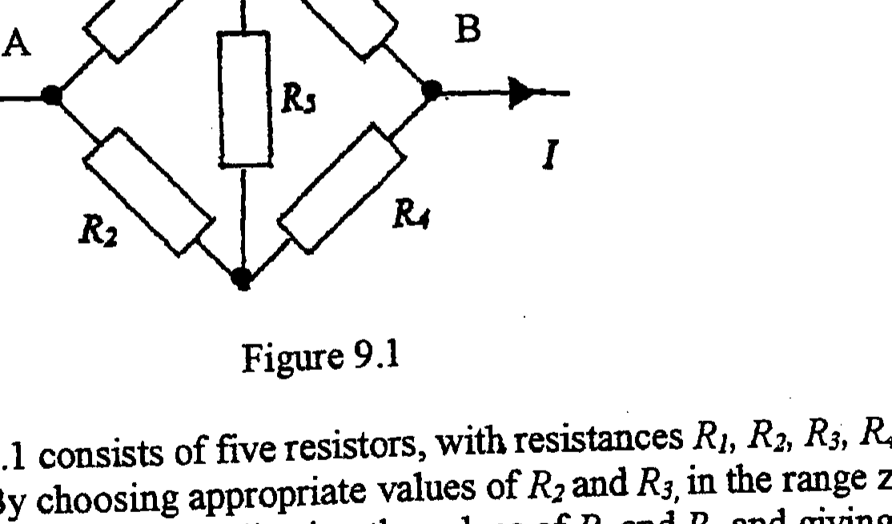
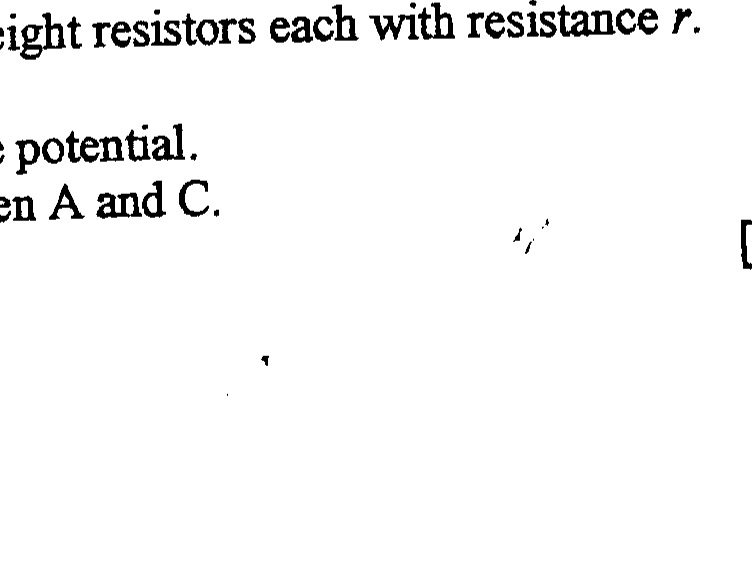

Q9
a)

Figure 9.1

The circuit in Figure 9.1 consists of five resistors, with resistances $R_{1}, R_{2}, R_{3}, R_{4}$ and $R_{5}$. The current $I$ enters at A. By choosing appropriate values of $R_{2}$ and $R_{3}$, in the range zero to infinity, reduce the circuit to the following, indicating the values of $R_{2}$ and $R_{3}$ and giving a circuit diagram:
(i) three resistors in series
(ii) three resistors in parallel with each other
(iii) two equal resistors in parallel
b) For each network in (a) calculate:
(1) The total resistance across AB
(2) The power dissipated in $R_{5}$
c)

Figure 9.2

The network in Figure 9.2 consists of eight resistors each with resistance $r$.
(i) Explain why B and D are at the same potential.
(ii) Determine the total resistance between A and C .
NAME OF TEACHER
SCHOOL
ADDRESS
POST CODE
TEL.NO
$\_\_\_\_$
$\_\_\_\_$
$\_\_\_\_$
$\_\_\_\_$
$\_\_\_\_$
$\_\_\_\_$

|  | Name of Candidate (First name and surname, plus Mr/Miss) | 1 | 2 | 3 | 4 | 5 | 6 | 7 | 8 | 9 | TOTAL |
| :--- | :--- | :--- | :--- | :--- | :--- | :--- | :--- | :--- | :--- | :--- | :--- |
| 1. |  |  |  |  |  |  |  |  |  |  |  |
| 2. |  |  |  |  |  |  |  |  |  |  |  |
| 3. |  |  |  |  |  |  |  |  |  |  |  |
| 4. |  |  |  |  |  |  |  |  |  |  |  |
| 5. |  |  |  |  |  |  |  |  |  |  |  |
| 6. |  |  |  |  |  |  |  |  |  |  |  |
| 7. |  |  |  |  |  |  |  |  |  |  |  |
| 8. |  |  |  |  |  |  |  |  |  |  |  |
| 9. |  |  |  |  |  |  |  |  |  |  |  |
| 10. |  |  |  |  |  |  |  |  |  |  |  |
