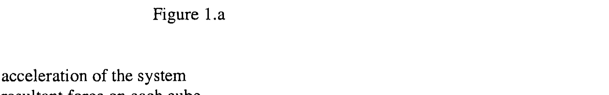
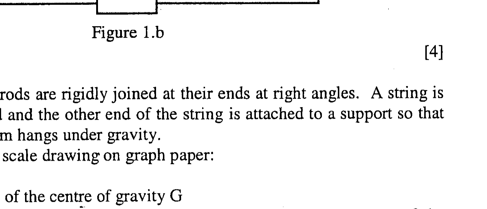
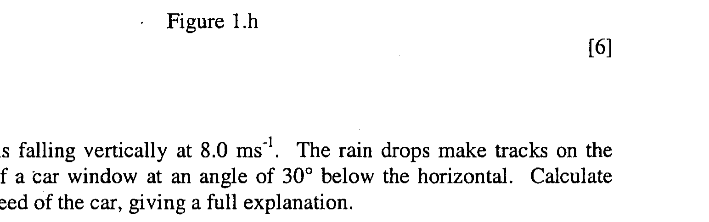

Q1.
(a) Six identical numbered cubes, each of mass $m$, lie in a straight line on a smooth horizontal table, Figure 1.a, touching adjacent cubes. A constant force $F$ is applied along the line of cubes.

Figure 1.a

Determine:
(i) the acceleration of the system
(ii) the resultant force on each cube.
(iii) the force exerted on the fifth cube by the fourth cube.
(b) The circuit in Figure 1.b contains a battery, emf $E$, and resistors all with resistance $r$. Determine the current $I$ through the battery.

Figure 1.b

(c) Two identical thin rods are rigidly joined at their ends at right angles. A string is attached to one end and the other end of the string is attached to a support so that the stationary system hangs under gravity.
Determine, using a scale drawing on graph paper:
(i) the position of the centre of gravity G
(ii) the magnitude of the angle between the vertical and the direction of the upper rod using a ruler and calculator only.
(d) A pond with water of density $\rho$ is covered to a depth $b$ by oil of density $2 \rho / 3$. A long stick of square cross-section, $4 b \times 4 b$, with the same density as the oil, floats in the pond. What fraction of the stick is immersed?
[5]
(e) Make the following estimates:
(i) the contribution of the gravitational attraction of the Sun to the acceleration of free fall on Earth.
(ii) the energy required for a man, mass $m$, to jump 1 m on the Earth and the size of the smallest body in the solar system from which a man will be unable to escape by jumping.
(iii) the rate of working of a student's heart if it beats at 72 beats per minute, pumping $7.5 \times 10^{-5} \mathrm{~m}^{3}$ of blood at each beat against a pressure of 19 kPa .
(f) A long thin copper strip, width $w$, is sandwiched between two insulating sheets, each of thickness $t$ and thermal conductivity $\kappa$, in an environment at $0^{\circ} \mathrm{C}$. The electrical resistance per unit length of the strip, $R$, at $\theta^{\circ} C$ is given by

$$
R=a(1+b \theta)
$$

where $a$ and $b$ are constants.
(i) What is the rate of heat generation in the copper strip, per unit length, by a current $I$ ?
(ii) Show that if the current $I$ through the strip is increased, a critical current, $I_{c}$, is reached at which the temperature increases indefinitely.
(iii) Calculate $I_{c}$ using the data in Table 1.f.

| Quantity | Value | Quantity | Value |
| :---: | :---: | :---: | :---: |
| $w$ | 5.00 mm | $a$ | $2.20 \times 10^{-2} \Omega \mathrm{~m}^{-1}$ |
| $t$ | 1.00 mm | $b$ | $4.30 \times 10^{-3} \mathrm{~K}^{-1}$ |
| $\kappa$ | $1.30 \times 10^{-1} \mathrm{Wm}^{-1} \mathrm{~K}^{-1}$ |  |  |

Table 1.f

(g) Use graph paper and a ruler to draw accurate ray diagrams for the following two optical situations:
(i) A point object is reflected in a plane mirror. Draw two rays of light from the object that are reflected in the mirror.
(ii) A point object is situated between two plane mirrors that are joined to form a right angle. Draw a ray of light from the object that is reflected in both mirrors.
(iii) If, in (ii), the ray is incident on the first mirror at an angle of incidence $\theta$, determine the angle through which the ray has been rotated after two reflections.
(h)
(i) A sound wave source transmits energy radially in all directions. It can just be detected at 0.50 km from the source, where the intensity is $1.00 \mathrm{pWm}^{-2}$. What is the power of the source?
(ii) What is understood by the superposition principle of two travelling waves? The two wave forms in Figure 1.h are travelling in opposite directions. Draw three diagrams to show the resultant wave forms when point O reaches $\mathrm{A}, \mathrm{B}$ and C .

Figure 1.h

(j)
(i) Rain is falling vertically at $8.0 \mathrm{~ms}^{-1}$. The rain drops make tracks on the side of a car window at an angle of $30^{\circ}$ below the horizontal. Calculate the speed of the car, giving a full explanation.
(ii) Calculate the maximum speed at which a car could travel across a humpbacked bridge, having a radius of curvature of 40.0 m , without leaving the road at the top of the bridge.
(iii) A 45 m length of rope, mass 15 kg , hangs over a smooth horizontal peg. One side of the rope is 5 m longer than the other. It is released from rest. When it is initially no longer in contact with the peg, and has not reached the ground, calculate the change in potential energy and the speed of the chain.
What effect does doubling the mass of the rope have on the speed?
(k) Using the data in Table 1.k, calculate the mass change and the energy released when 10.0 kg of ${ }_{92}^{235} \mathrm{U}$ undergoes the fission reaction ( $1 \mathrm{u}=931 \mathrm{MeV}$ ):

$$
{ }_{92}^{235} U+{ }_{0}^{1} n \rightarrow{ }_{56}^{141} B a+{ }_{36}^{92} K r+3{ }_{0}^{1} n
$$

| Nucleus | Mass / u |
| :---: | :---: |
| ${ }_{92}^{235} \mathrm{U}$ | 235.04 |
| ${ }_{56}^{141} \mathrm{Ba}$ | 140.91 |
| ${ }_{96}^{92} \mathrm{Kr}$ | 91.91 |
| ${ }_{0}^{1} \mathrm{n}$ | 1.01 |

Table 1.k

(1) A fibre optic cable, surrounded by air of refractive index $n_{a}$, consists of a glass core of refractive index $n_{g}$ enclosed in cladding of refractive index $n_{c}$.
(i) Explain, with a diagram, how light is transmitted down the cable with little loss of intensity.
(ii) What are the limitations on the light paths?
(m) A car starts from rest at time $t=0$ and travels with constant acceleration $a_{1}$ for time $t_{1}$. From time $t_{1}$ to $t_{2}$ it travels with constant speed $u$. After $t_{2}$ a retarding acceleration is applied, of initial magnitude $a_{2}$, which decreases linearly to zero at time $t_{3}$ when the car comes to rest.

Sketch the following graphs:
(i) acceleration - time
(ii) velocity - time
(iii) distance - time
