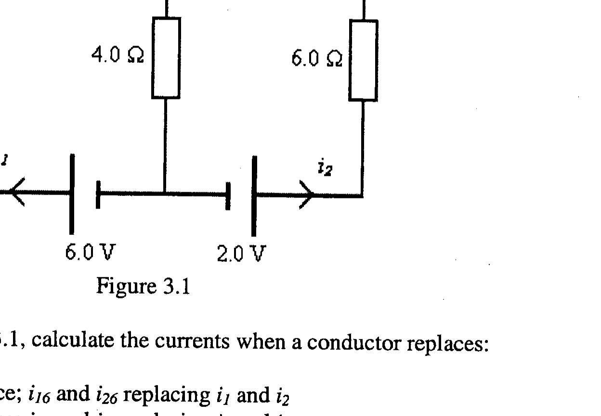

Q3.

Figure 3.1

(a) In the circuit, Figure 3.1, calculate the currents when a conductor replaces:
(i) the 6.0 V source; $i_{16}$ and $i_{26}$ replacing $i_{1}$ and $i_{2}$
(ii) the 2.0 V source; $i_{12}$ and $i_{22}$ replacing $i_{1}$ and $i_{2}$
[4]
(b) It can be shown that the currents in Figure 3.1 are given by $i_{1}=i_{16}+i_{12}$ and $i_{2}=i_{26}+i_{22}$.
(i) Determine, using this result, $i_{1}$ and $i_{2}$.
(ii) Deduce the current through the $4.0 \Omega$ resistor.
(iii) Verify that $i_{1}$ and $i_{2}$ satisfy Kirchoff's equations for the circuit.
(c)
(i) Calculate the power dissipated in the $4.0 \Omega$ resistor.
(ii) Determine the rate of energy conversion for the 6.0 V cell.
(d)
(i) What modifications, if any, are required to the solutions to (b)(i), if the batteries are replaced by a.c. sources with, respectively, amplitudes of 6.0 V and 2.0 V and a common phase and angular frequency $\omega$ ?
(ii) Comment on the case in which the a.c. sources of voltage in (i) differ in phase by $\pi$.
