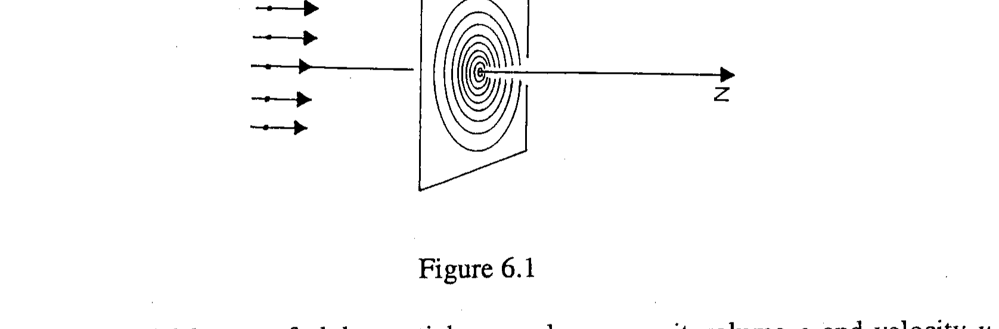
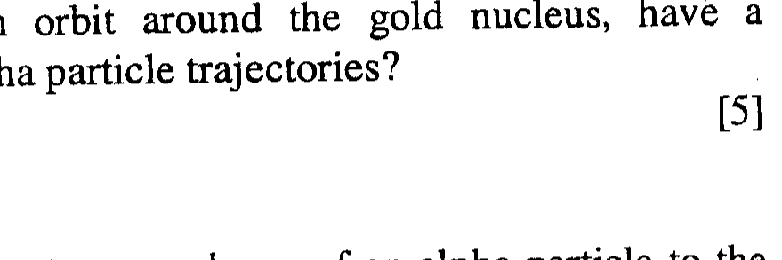

Q5.

| $\mathrm{I} / \mathrm{mA}$ | $\mathrm{V} / \mu \mathrm{V}$ |
| :---: | :---: |
| 2 | 2201 |
| 3 | 3302 |
| 4 | 4428 |
| 5 | 5514 |
| 6 | 6624 |

(a)

| $\mathrm{t} / \mathrm{ms}$ | $\mathrm{R} / \mathrm{m}$ |
| :---: | :---: |
| 0.24 | 19.9 |
| 0.66 | 31.9 |
| 1.22 | 41.0 |
| 4.61 | 67.3 |
| 15.00 | 106.5 |

(b)

Table 5.1
(a) In an experiment to determine the self heating of a platinum resistance thermometer the values of current, $I$, and voltage, $V$, Table 5.1 (a), were transcribed from a laboratory notebook. The uncertainties in $V$ are of the order $1 \mu \mathrm{~V}$ and the values of $I$ were of a much greater accuracy than those of $V$.
(i) Identify and explain any anomalous result/s in Table 5.1 (a)
(ii) What should be done about it/them?
(iii) Show graphically that the resistance, $R$, of the thermometer increases linearly with $I^{2}$ due to a self heating.
(iv) Determine the parameter/s, and their accuracy, that determine the relation between $R$ and $I^{2}$. Give explicitly the equation relating $R$ and $I^{2}$.
(b) The explosion of an atomic bomb in the atmosphere produces a spherical fireball of radius $R(t)$ at time $t$ following detonation. The constant energy $E$ released at this instant depends on $R, t$ and $\rho$, where $\rho$ is the density of the atmosphere. The relation between these parameters is given by

$$
E=\rho R^{\alpha} \cdot t^{-2}
$$

where $\alpha$ and $\rho$ are constants.
Explain how, from a graph, you could:
(i) verify that the data in Table 5.1 (b), taken following an explosion, satisfies this relation.
(ii) deduce the relation between $E$ and $\rho$.
(iii) obtain the value of $\alpha$ from the graph.

Determine the theoretical value of $\alpha$ obtained by equating units or dimensions in the equation.

Figure 6.1

A uniform parallel beam, of alpha particles, number per unit volume $\rho$ and velocity $u$, each consisting of two protons and two neutrons, travels along the z-axis. Consider a plane perpendicular to the z -axis consisting of concentric circles, centres on the z -axis, with radii $n t$, where the constant $t$ is the radial distance between adjacent circles and $n$ is an interger $(0,1,2,3 \ldots)$, Figure 6.1.
(i) Determine the number $N$ of alpha particles per second that pass through an annulus between the $n$th and $(n+1)$ th circle.
(ii) Sketch the graph of $N$ against $n$.
(b) The beam of alpha particles encounters a fixed gold nucleus, along the $z$-axis, consisting of 79 protons and 118 neutrons, Figure 6.2.

Figure 6.2.

(i) Sketch the trajectories of the three alpha particles indicated in Figure 6.2.
(ii) Why are relatively few particles scattered through large angles?
(iii) What is the largest angle through which a particle is scattered?
(iv) Why do bound electrons, in orbit around the gold nucleus, have a negligible influence on the alpha particle trajectories?
(c)
(i) Determine the distance of closest approach, $r_{l}$, of an alpha particle to the nucleus.
(ii) If the gold nucleus is free to move and initially at rest, what is the velocity of an alpha particle relative to the gold nucleus at the distance of closest approach, $r_{2}$ ? Determine $r_{2}$ in this case.

Assume the masses of the neutron and proton are both equal to $m$.
