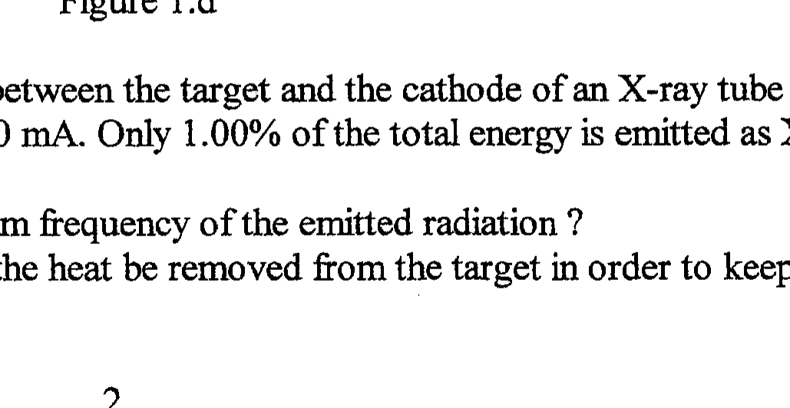

Q1 (a) How does the proton number, $Z$, and the nucleon number, $A$, of a nucleus change due to:
(i) the emission of an alpha particle?
(ii) the emission of a beta particle?
(iii) the fusion with a deuterium nucleus?
(b) (i) A lorry is moving at a constant velocity along a road. It has rear wheel drive. Draw a diagram showing the forces exerted by the road on the wheels of the vehicle.
(ii) A jet plane, in level flight, is flying at constant velocity. Draw a diagram indicating the forces acting on the plane. State the nature of these forces and their relations.
(c) In the right angle triangle ABP , Figure 1.a, there is a charge of 100 nC at A and a charge of 576 nC at $\mathrm{B} . \mathrm{AP}=50 \mathrm{~mm}, \mathrm{BP}=120 \mathrm{~mm}$ and $\mathrm{AB}=130 \mathrm{~mm}$.

Figure 1.c

What is the magnitude and direction of the electric field, $E$, at P ?
(d) The circuit in Figure 1.d consists of a cell of emf $E$ and resistors, each with resistance $R$. Calculate the current $I$ through the battery .

Figure 1.d

(e) The potential difference between the target and the cathode of an X-ray tube is 50.0 kV . The current in the tube is 20.0 mA . Only $1.00 \%$ of the total energy is emitted as X-rays.
(i) What is the maximum frequency of the emitted radiation?
(ii) At what rate must the heat be removed from the target in order to keep it at a constant temperature?
(f) A lead bullet at 320 K is stopped by a sheet of steel so that it reaches its melting point of 600 K and completely melts. If $80 \%$ of the kinetic energy of the bullet is converted into its internal energy, calculate the speed with which the bullet hit the steel sheet. The specific heat capacity of lead is 0.12 $\mathrm{kJ} \mathrm{kg}^{-1} \mathrm{~K}^{-1}$ and its specific latent heat of fusion is $21 \mathrm{~kJ} \mathrm{Kg}^{-1}$.
(g) A uranium bearing rock contains 9 uranium atoms to every 8 helium atoms. Assuming the decay process, which converts a uranium atom into a lead atom, involves the emission of 8 alpha particles, calculate the age of the rock. The half life of uranium is $4.5 \times 10^{9}$ years.
(h) Estimate, making reasonable assumptions where necessary :
(i) the pressure excess in a champagne bottle if the cork can be projected vertically 6 m . Assume the cork experiences a constant force for the first 2 cm of its flight .
(ii) the mean thickness of a layer of rubber left on the road by a car tyre which, during $50,000 \mathrm{~km}$ of travelling, loses 5 mm of tread.
(j) A large tank contains water to a depth of 1.00 m and stands on the floor. Water spurts from a small hole in the side of the tank 20 cm below the level of the surface. Calculate :
(i) the speed, $v$, with which the water emerges from the hole
(ii) the distance, $d$, measured from the base of the tank at which the water strikes the floor.
(iii) the height, $h$, above the floor at which a second hole should be drilled so that water ejected hits the floor at the same point as in (ii).
(k) Calculate the mass of electrons, $M_{e}$, in terms of the fraction of the Earth's mass, $M_{E}$, that is required to be taken from the Earth to the Moon in order to double the force of attraction between these two bodies. Assume $M_{e}$ is much less than $M_{E}$. The mass of the Moon is $0.0123 M_{E}$.
(l) When monochromatic light, wavelength $\lambda$, is reflected almost normally from two glass plates, one on top of the other with a very small angle, $\theta$, between them, bright and dark interference fringes are observed.
(i) Explain how these fringes arise .
(ii) How does the separation of the fringes depend on $\theta$ ?
(iii) What is the effect of filling the volume between the plates with water?
(m) A 0.20 kg mass is attached to the lower end of a helical spring which is fixed at its upper end. The vertical spring is extended by 0.16 m when in equilibrium. Determine :
(i) the change in gravitational potential energy of the mass due to the spring's extension
(ii) the elastic energy stored in the spring
(iii) Why do the magnitudes of (i) and (ii) differ ?

The mass is pulled down a further distance of 0.08 m and released.
(iv) What is its kinetic energy when passing through the equilibrium position ?
(v) What is its period of oscillation ?
(vi) If the upper end of the spring is released, describe the motion of the mass and the spring.
(n) A bicycle tyre has a volume of $1.2 \times 10^{-3} \mathrm{~m}^{3}$ when fully inflated. The barrel of a bicycle pump has a working volume of $9.0 \times 10^{-5} \mathrm{~m}^{3}$. How many strokes of the pump are needed to inflate the, initially, completely flat tyre to a total pressure of $3.0 \times 10^{5} \mathrm{~Pa}$ ? The atmospheric pressure is $1.0 \times 10^{5} \mathrm{~Pa}$. Assume the air is pumped slowly so that the temperature does not change.

Explain why, in practice, the barrel of the bicycle pump increases in temperature when the pumping is not slow.
(o) A uniform plank, AB , mass $m$, of length $2 l$ is supported at each end by vertical forces, $S_{A}$ and $S_{B}$ respectively. A man of mass $M$ walks across the plank. Determine $S_{A}$ and $S_{B}$ when the man is a distance $x$ from $B$. Plot, on a single graph, the variation of $S_{A}$ and $S_{B}$ with $x$.
[6]
