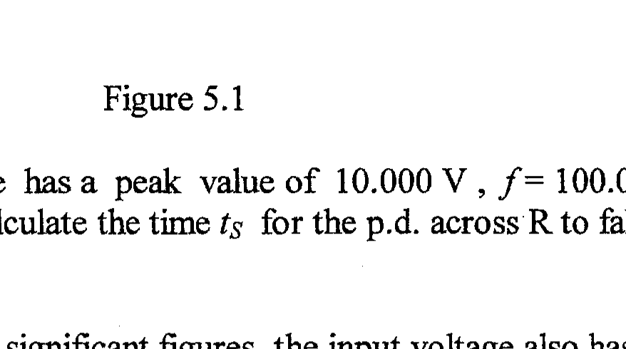

Q5 (a) Two uncharged capacitors, $\mathrm{C}_{1}$ and $\mathrm{C}_{2}$, with capacitances $C_{1}$ and $C_{2}$, are connected in series with a battery and a switch S . When the switch is closed there is a charge $Q_{1}$ on $\mathrm{C}_{1}$ and $Q_{2}$ on $\mathrm{C}_{2}$.
(i) What is the relation between $Q_{1}$ and $Q_{2}$ ?
(ii) Give an expression for the potential difference across each capacitor.
(iii) Derive an expression for the capacitance, $C$, of a single capacitor equivalent to $C_{1}$ in series with $\mathrm{C}_{2}$.
(iv) Calculate the total energy stored in the capacitors.
(b) An a.c. source of voltage $V$ and frequency $f$ is in series with a diode and a resistor, resistance $R$.
(i) Sketch a graph of the p.d., $V_{R}$, across the resistor as a function of time $t$.
(ii) Capacitors can be used to 'smooth' rectified a.c. voltages. A capacitor, capacitance $C$, is connected in parallel with the resistor, Figure 5.1. Explain, with a graph, how the modified p.d., $V_{R}$, varies with $t$.

Figure 5.1

(iii) If the input voltage has a peak value of $10.000 \mathrm{~V}, f=100.000 \mathrm{~Hz}, C=400.000 \mu \mathrm{~F}$ and $R=100.000 \Omega$, calculate the time $t_{S}$ for the p.d. across R to fall to its smallest value of 7.99049 V .
(iv) Verify that , to four significant figures, the input voltage also has this value at this time .
(v) The voltage across R can be approximated by the sum of a d.c. component, $V_{d}$, and an a.c. component with amplitude $V_{a}$ and frequency $f_{a}$. Estimate the values of $V_{d}, V_{a}$, and $f_{a}$.
