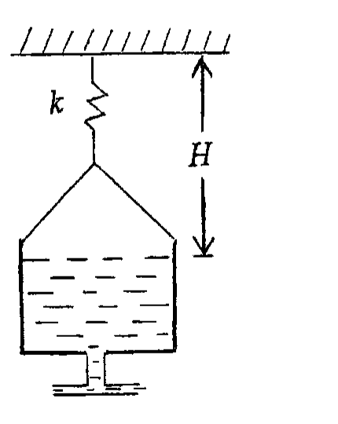
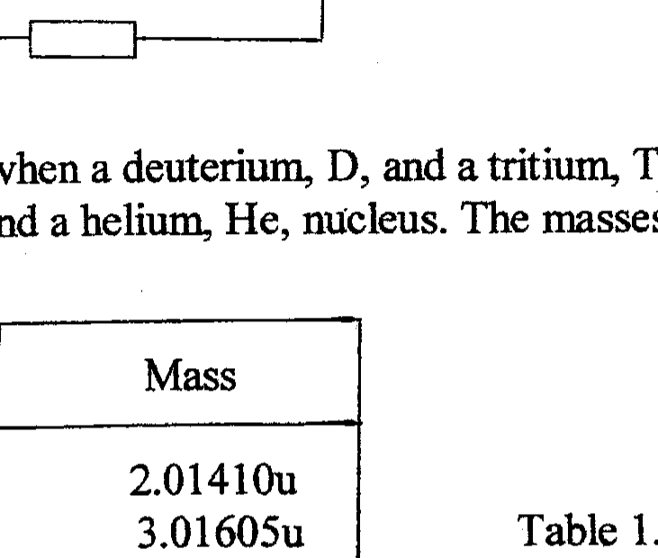
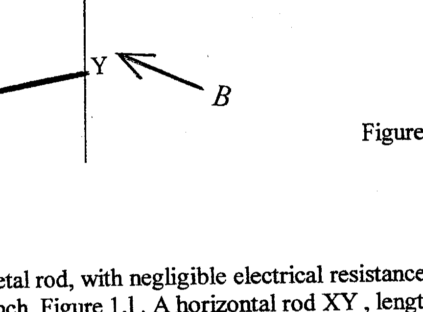

## Q1

(a) A cricket ball of mass 0.167 kg is thrown vertically upwards with an initial speed of 25.0 $\mathrm{ms}^{-1}$. If the ball reaches a maximum height of 20.0 m , determine the percentage loss of energy caused by air resistance.
(b) An earthquake off the coast of Sumatra, Indonesia, at A produces mechanical P and S waves that travel through the mantle of the Earth at speeds, respectively, of $5.50 \mathrm{kms}^{-1}$ and $3.00 \mathrm{kms}^{-1}$. If the S wave arrives at the coastal station B , across the Indian ocean near Mombasa, Kenya, 15 mins 17 s after the P wave, determine:
(i) the distance, $D$, of B from A
(ii) the time, $T$, taken by a tsunami, produced by the earthquake, to arrive at B if it travels at $800 \mathrm{kmh}^{-1}$.
(iii) On what principle could a tsunami warning system be established ?
(c) A class of 11 students each determined a value for $g$ using a simple pendulum. The following values were obtained:

$$
9.80,9.84,9.72,9.74,9.87,9.75,9.28,9.86,9.81,9.79,9.82
$$

(i) What is your best estimate for $g$ ?
(ii) Estimate the accuracy, based on the deviation from the best value of $g$ in (i). [4]
(d) A man in a boat, floating on a pond of area $A$, has with him a stone bolder, of mass $M_{B}$ and density $\rho_{\mathrm{B}}$, and a timber block, of mass $M_{T}$ and density $\rho_{\mathrm{T}}$. The water has density $\rho_{\mathrm{w}}$. By how much does the level of the water in the pond change if he throws into the pond:
(i) the bolder ?
(ii) the timber block?

Give a full explanation in each case.
(e) An open cylindrical container, radius 18 cm , contains water of density $1000 \mathrm{kgm}^{-3}$. It has a hole in the base connected to a horizontal exit tube, Figure 1.e. The container is suspended by a spring, spring constant $k$, from a support, a vertical distance, $H$, from the water surface. As the water drains out of the container, what value of $k$ is required to maintain the surface of the water at its initial distance $H$ below the support ?

Figure 1.e

(f) A vehicle is travelling at 60 mph along a straight road, without slipping. What are the velocities at the 'compass points', $N, S, E$, and $W$, of the rim of the wheel?
(g) A pulsed source of microwaves produces bursts of $20 \mathrm{GHz}\left(20 \times 10^{9} \mathrm{~Hz}\right)$ radiation. Each burst has a duration of 1.0 ns . A parabolic reflector, radius 6.0 cm , is used to produce a parallel beam of radiation. The average power output of each pulse is 25 kW . Determine:
(i) the wavelength, $\lambda$, of the radiation
(ii) the total energy, $E$, of each pulse
(iii) the energy density, $U$, propagated by the reflector
(iv) the momentum density, $P$, propagated by the reflector
(h) A constant horizontal acceleration is applied to a box, initially at rest, of mass 1.2 kg for 10.0 s . Its final speed is $0.40 \mathrm{~ms}^{-1}$. What is the force, F , required ?

The box is maintained at this constant velocity on a frictionless track whilst a continuous vertical stream of sand is deposited on it at the rate of $5.0 \mathrm{gms}^{-1}$, impacting at $10 \mathrm{~ms}^{-1}$. Determine the vertical force, $F_{V}$, on the box due to the falling sand and the horizontal force, $F_{H}$, required to maintain the constant velocity of the box.
(j) In the circuit in Figure 1.j all the resistors have resistance $r$ and the cells have emfs $E$. Calculate the current, $I$, flowing through each cell.

Figure 1.j

(k) Determine the energy released when a deuterium, D, and a tritium, T, nucleus are fused together to yield a neutron, n, and a helium, He, nucleus. The masses of these particles are given in Table 1.j.

| Particle | Mass |
| :---: | :---: |
| D | 2.01410 u |
| T | 3.01605 u |
| n | 1.00867 u |
| He | 4.00260 u |

Table 1.k

$$
\mathrm{u}=1.66050 \times 10^{-27} \mathrm{~kg} .
$$

Figure 1.1

(l) An inverted U-shaped metal rod, with negligible electrical resistance, is erected in a vertical plane on a bench, Figure 1.1. A horizontal rod XY, length $L$, equal to the distance between the arms of the U, mass $m$ and electrical resistance $R$, can slide freely down the arms of the U. A homogeneous magnetic field of flux density $B$ is perpendicular to the plane of the U .
(i) If the horizontal rod falls from rest, under gravity, it will reach a terminal velocity. Explain why this occurs.
(ii) Calculate the magnitude and direction of the current, $I$, produced after the terminal velocity, $v$, of the rod is attained.
(iii) By considering the terminal motion during a small time interval, $\Delta t$, show that the loss in gravitational potential energy is equal to the heat dissipated.
[10]
(m) A source of sound, emitting a note of frequency 500 Hz , starts from a stationary observer and travels directly towards a wall at speed $v$. The speed of sound is $\mathrm{c}_{\mathrm{s}}=340 \mathrm{~ms}^{-1} \cdot v$ is much less than $c_{s}$. Derive an expression for the frequency received by the stationary observer :
(i) directly from the source
(ii) after reflection from the wall
(iii) Determine the value of $v$, which is small compared with $\mathrm{c}_{s}$, if the observer detects a beat frequency of 30 Hz .
(n) The present day abundances of the isotopes $\mathrm{U}^{238}$ and $\mathrm{U}^{235}$ are in the ratio 140:1. They have half lives, respectively, of $4.5 \times 10^{9}$ and $7.1 \times 10^{8}$ years. Estimate the age of the Earth assuming that equal amounts of each isotope existed at the formation of the Earth.
