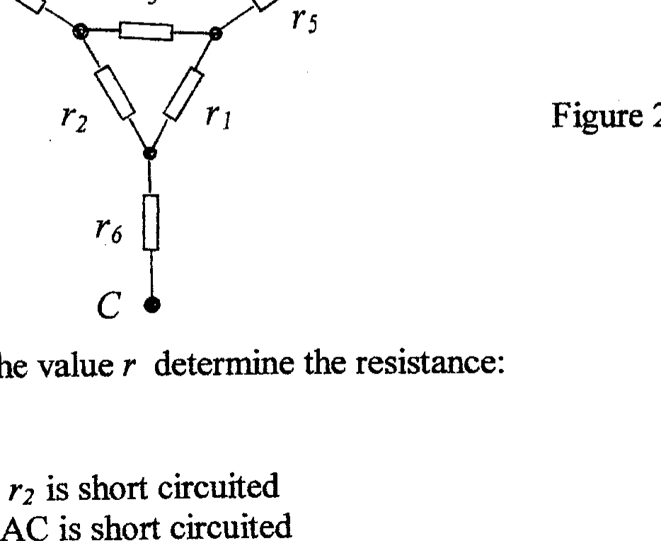

## Q2

Six resistors with resistances, in ohms, of $r_{1}, r_{2}, r_{3}, r_{4}, r_{5}$, and $r_{6}$ are connected as indicated in Figure 2.1.

Figure 2.1

(a) If all the resistances have the value $r$ determine the resistance:
(i) $\quad R_{I}$ across AB
(ii) $\quad R_{2}$ across AB when $r_{2}$ is short circuited
(iii) $R_{3}$ across AB when AC is short circuited
(b) The resistors in Figure 2.1 have resistances, of $1,2,3,4,5$ and 6 ohms, with no two resistors having the same value. Initially all resistors are unspecified.
(i) Obtain an algebraic expression for the resistance, $R_{A B}$, across AB . Express it as a rational fraction i.e. in terms of an algebraic numerator and denominator.
(ii) If $13 R_{A B}=94$, deduce the value of $\left(r_{1}+r_{2}+r_{3}\right)$.
(iii) Show that $R_{A B}$ can be expressed as
where

$$
R_{A B}=n_{1}+n_{2}+p
$$

$$
p=n_{3}\left(13-n_{3}\right) / 13
$$

and $n_{1}, n_{2}$, and $n_{3}$ are integers.
(iv) Evaluate $p$ for all six possible values of $n_{3}$ and deduce the value of $r_{3}$. Similarly deduce the values of $r_{2}$ and $r_{I}$ if $13 R_{\mathrm{AC}}=87$ and $13 R_{\mathrm{BC}}=131$.
(v) Determine the possible values of $n_{1}$ and $n_{2}$, hence $r_{4}$ and $r_{5}$, for $R_{A B}$.
(vi) Similarly obtain the possible values of $n_{1}$ and $n_{2}$ for $R_{\mathrm{AC}}$ and $R_{B C}$. and deduce the values of $r_{4}, r_{5}$, and $r_{6}$.
