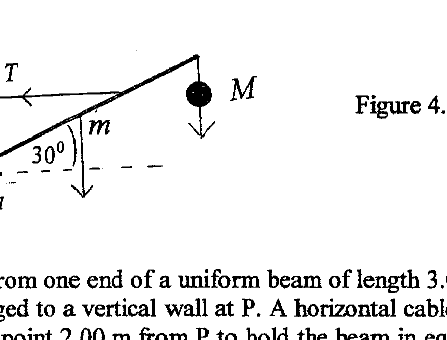
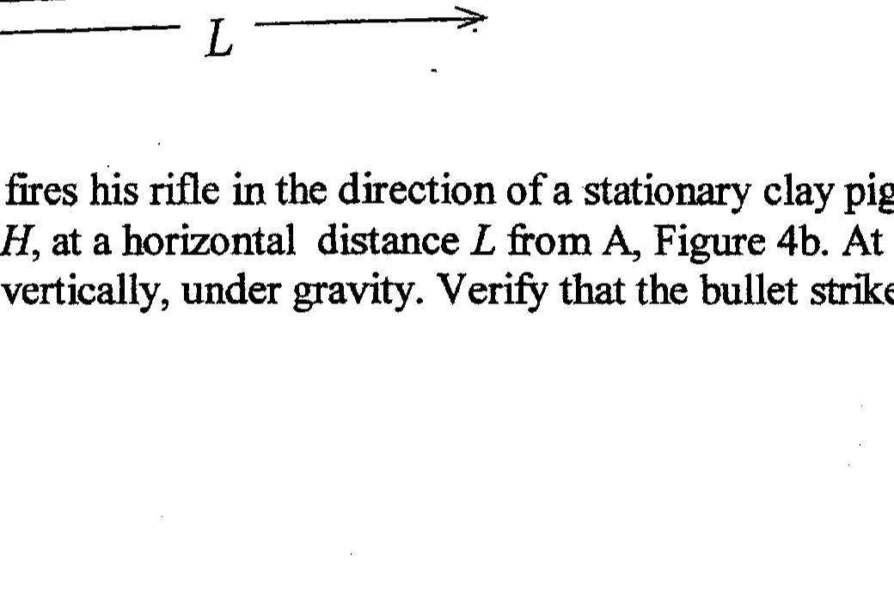

Q4

Figure 4.a

(a) A mass $M=100 \mathrm{~kg}$ hangs from one end of a uniform beam of length 3.00 m and mass $m=2.00 \mathrm{~kg}$. The other end is hinged to a vertical wall at P . A horizontal cable, of negligible mass, is attached to the beam at a point 2.00 m from P to hold the beam in equilibrium at an angle of $30^{0}$ to the horizontal, Figure 4.a.

Determine:
(i) the tension $T$ in the cable
(ii) the horizontal and vertical components of the forces of the hinge on the beam, $F_{H}$ and $F_{V}$ respectively.
(b)

Figure 4.b

A marksman on the ground at A fires his rifle in the direction of a stationary clay pigeon located in a tower at B , height $H$, at a horizontal distance $L$ from A , Figure 4b. At this instant the pigeon is released and falls vertically, under gravity. Verify that the bullet strikes the pigeon during its fall.
